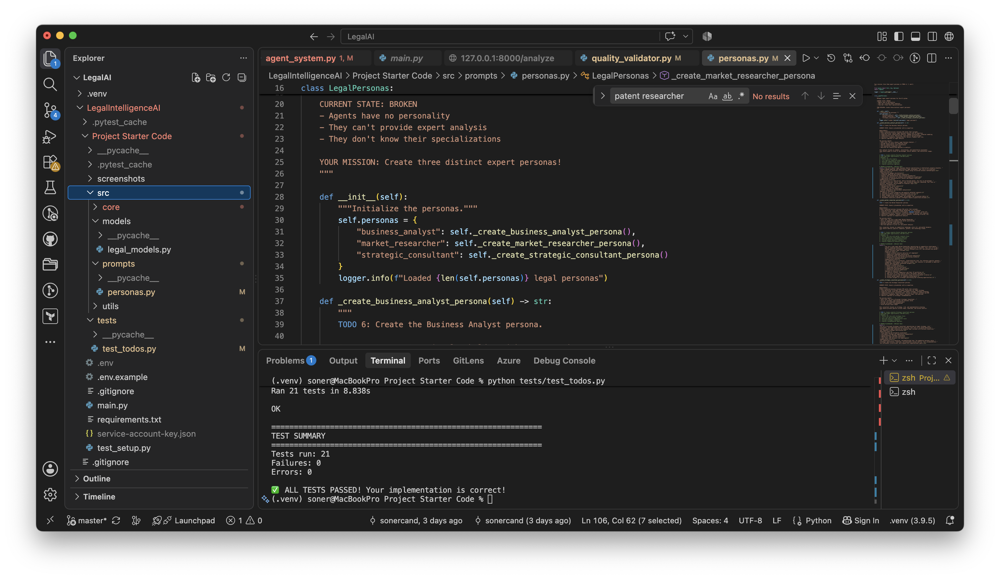
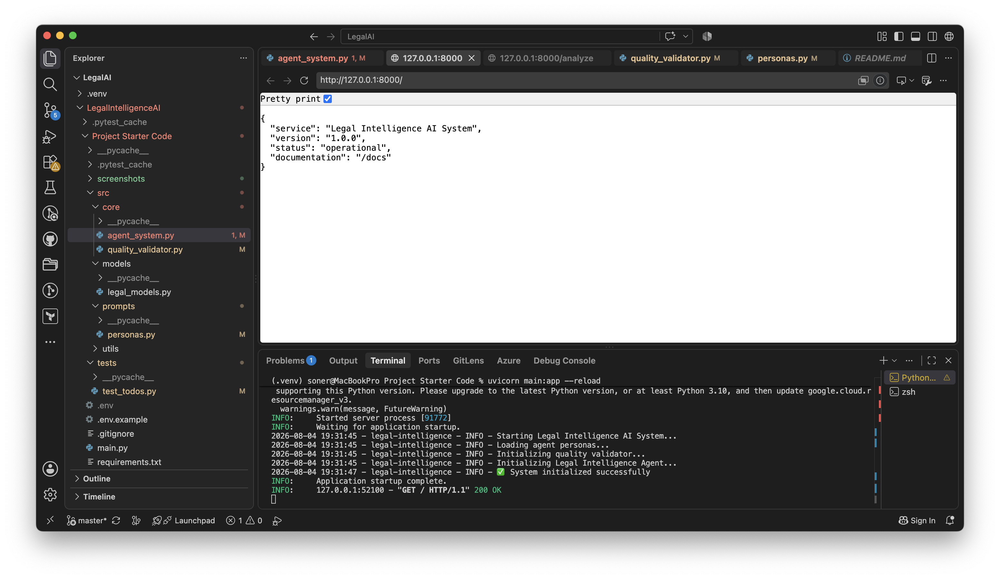
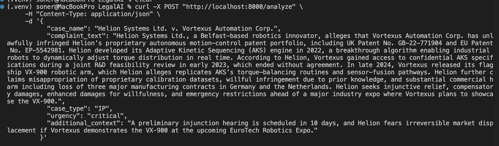
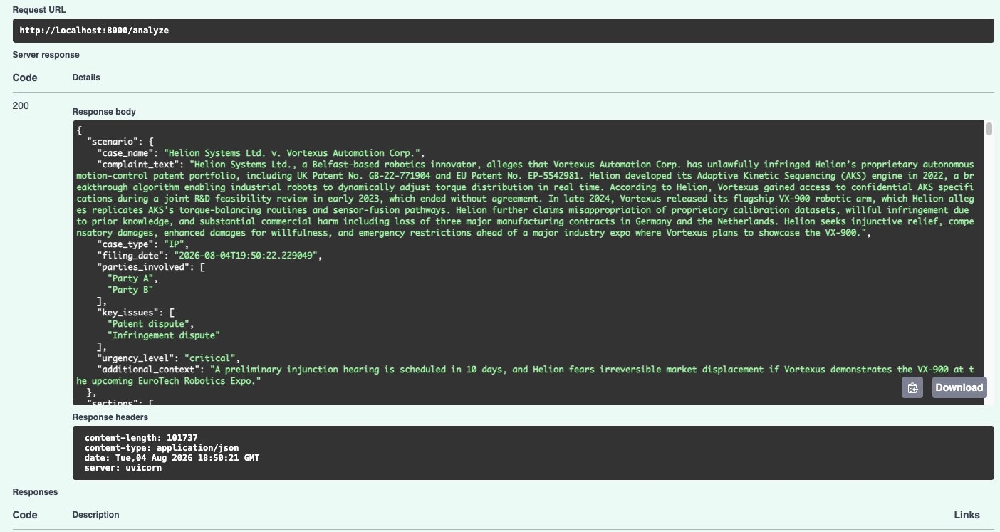

## 1. Test Suite Results
All TODO tests passed successfully.

Screenshot: Test Results

## 2. Server Startup

## 3. API Analysis via localhost docs
payload

response

### API Response
 <code> 
 
    {
    "scenario": {
      "case_name": "Helion Systems Ltd. v. Vortexus Automation Corp.",
      "complaint_text": "Helion Systems Ltd., a Belfast-based robotics innovator, alleges that Vortexus Automation Corp. has unlawfully infringed Helion’s proprietary autonomous motion-control patent portfolio, including UK Patent No. GB-22-771904 and EU Patent No. EP-5542981. Helion developed its Adaptive Kinetic Sequencing (AKS) engine in 2022, a breakthrough algorithm enabling industrial robots to dynamically adjust torque distribution in real time. According to Helion, Vortexus gained access to confidential AKS specifications during a joint R&D feasibility review in early 2023, which ended without agreement. In late 2024, Vortexus released its flagship VX‑900 robotic arm, which Helion alleges replicates AKS’s torque-balancing routines and sensor-fusion pathways. Helion further claims misappropriation of proprietary calibration datasets, willful infringement due to prior knowledge, and substantial commercial harm including loss of three major manufacturing contracts in Germany and the Netherlands. Helion seeks injunctive relief, compensatory damages, enhanced damages for willfulness, and emergency restrictions ahead of a major industry expo where Vortexus plans to showcase the VX‑900.",
      "case_type": "IP",
      "filing_date": "2026-08-04T19:50:22.229049",
      "parties_involved": [
        "Party A",
        "Party B"
      ],
      "key_issues": [
        "Patent dispute",
        "Infringement dispute"
      ],
      "urgency_level": "critical",
      "additional_context": "A preliminary injunction hearing is scheduled in 10 days, and Helion fears irreversible market displacement if Vortexus demonstrates the VX‑900 at the upcoming EuroTech Robotics Expo."
    },
    "sections": [
      {
        "type": "liability_assessment",
        "title": "Liability Assessment",
        "content": "SECTION TITLE: Liability Assessment\n\n1.  **Key Issues**\n\n    The primary legal issues central to Helion Systems Ltd. v. Vortexus Automation Corp. are:\n    *   **Patent Infringement:** Whether Vortexus's VX-900 robotic arm infringes Helion's UK Patent No. GB-22-771904 and EU Patent No. EP-5542981, specifically regarding its Adaptive Kinetic Sequencing (AKS) engine's torque-balancing routines and sensor-fusion pathways.\n    *   **Trade Secret Misappropriation:** Whether Vortexus unlawfully acquired and utilized Helion’s confidential AKS specifications and proprietary calibration datasets, obtained during a prior R&D feasibility review.\n    *   **Willful Infringement:** Whether Vortexus's alleged infringement was deliberate and with knowledge of Helion's intellectual property rights, thereby warranting enhanced damages.\n    *   **Injunctive Relief Entitlement:** Whether Helion can demonstrate a high probability of success on the merits for infringement and irreparable harm to secure a preliminary injunction.\n\n2.  **Fact Analysis**\n\n    *   **Patent Infringement:**\n        *   **Helion's IP:** Helion developed its AKS engine in 2022, protected by UK Patent GB-22-771904 and EU Patent EP-5542981. These patents cover a breakthrough algorithm for dynamic torque distribution and sensor-fusion pathways in industrial robots.\n        *   **Vortexus's Product:** Vortexus released its VX-900 robotic arm in late 2024. Helion alleges the VX-900 \"replicates AKS’s torque-balancing routines and sensor-fusion pathways.\" This constitutes a direct claim of technical overlap.\n        *   **Access/Knowledge:** Vortexus gained access to \"confidential AKS specifications\" during a joint R&D feasibility review in early 2023, prior to the VX-900's development and release. This establishes a clear opportunity for Vortexus to have understood Helion's patented technology.\n\n    *   **Trade Secret Misappropriation:**\n        *   **Confidentiality:** Helion's \"confidential AKS specifications\" and \"proprietary calibration datasets\" were disclosed to Vortexus under the implied or explicit understanding of confidentiality during the R&D review. The failure to reach an agreement after the review indicates that the information was not licensed.\n        *   **Improper Means/Unauthorized Use:** The subsequent release of the VX-900, which allegedly replicates the core functionalities, suggests unauthorized use of the confidential information. The \"prior knowledge\" aspect strengthens this claim.\n        *   **Secrecy Efforts:** The description \"confidential\" and \"proprietary\" implies Helion took reasonable steps to maintain secrecy, a prerequisite for trade secret protection.\n\n    *   **Willful Infringement:**\n        *   **Knowledge of IP:** Vortexus's participation in the early 2023 R&D feasibility review, where \"confidential AKS specifications\" were shared, provides a strong factual basis for demonstrating prior knowledge of Helion's technology and potentially its patent applications/rights.\n        *   **Continued Infringement:** Despite the R&D review ending without agreement, Vortexus proceeded to develop and release a product allegedly incorporating the same technology. This suggests a conscious decision to utilize Helion's IP without authorization.\n\n    *   **Urgency & Irreparable Harm:**\n        *   **Market Displacement:** Helion fears \"irreversible market displacement\" if Vortexus showcases the VX-900 at the EuroTech Robotics Expo.\n        *   **Commercial Harm:** Helion claims \"loss of three major manufacturing contracts in Germany and the Netherlands,\" which directly links the alleged infringement to demonstrable commercial damage and market erosion.\n\n3.  **Legal Principles**\n\n    *   **Patent Infringement (UK/EU):**\n        *   Infringement is typically assessed in two stages: (1) construction of the patent claims, and (2) comparison of the construed claims to the accused product.\n        *   Under the European Patent Convention (EPC) and national laws (e.g., UK Patents Act 1977), infringement can be literal (the accused product falls squarely within the claim language) or by the doctrine of equivalents (the accused product performs substantially the same function in substantially the same way to achieve substantially the same result, even if not literally matching claim language).\n        *   The \"Protocol on the Interpretation of Article 69 EPC\" guides claim interpretation, balancing the literal meaning with the broader inventive concept.\n        *   The burden of proof for infringement lies with the patent holder, Helion.\n\n    *   **Trade Secret Misappropriation (UK/EU):**\n        *   Governed by the UK Trade Secrets Regulations 2018 (implementing EU Directive 2016/943).\n        *   A trade secret must be (1) secret, (2) have commercial value because it is secret, and (3) have been subject to reasonable steps by the holder to keep it secret.\n        *   Misappropriation occurs through unauthorized acquisition, use, or disclosure. Disclosure during a feasibility review, followed by unauthorized use without agreement, constitutes a strong basis for a misappropriation claim.\n        *   The existence of a confidential relationship during the R&D review is critical for establishing improper acquisition or use.\n\n    *   **Willful Infringement (UK/EU):**\n        *   While \"willful infringement\" as a distinct cause of action for enhanced damages is more pronounced in U.S. law, similar principles exist in UK/EU jurisprudence under the concept of \"flagrant\" or \"aggravated\" infringement. This can lead to higher damage awards or account of profits.\n        *   Proof typically requires demonstrating that the infringer knew of the patent and infringed it anyway, or was objectively reckless as to the existence of the patent or its infringement. Vortexus's prior access to \"confidential AKS specifications\" during the R&D review provides a strong evidentiary foundation for establishing such knowledge or recklessness.\n\n    *   **Preliminary Injunction (UK/EU):**\n        *   Courts apply tests, often involving a balance of convenience and the \"American Cyanamid\" principles (serious question to be tried, adequacy of damages as a remedy, balance of convenience).\n        *   For IP cases, demonstrating a strong prima facie case for infringement and evidence of irreparable harm (e.g., market displacement, loss of market share, damage to reputation that cannot be adequately compensated by damages) are crucial. Helion's claim of \"irreversible market displacement\" and \"loss of three major manufacturing contracts\" directly addresses the irreparable harm criterion.\n\n4.  **Conclusions**\n\n    Based on the presented facts and applicable legal principles, the probability of establishing liability against Vortexus Automation Corp. is assessed as follows:\n\n    *   **Patent Infringement (GB-22-771904 & EP-5542981):**\n        *   **Probability of Success:** **75-85%**.\n        *   **Reasoning:** Helion's direct assertion of \"replication\" of core patented functionalities (torque-balancing, sensor-fusion) is strong. Vortexus's prior access to \"confidential AKS specifications\" during the 2023 R&D review significantly increases the likelihood that their subsequent VX-900 product incorporates the patented technology, either literally or under the doctrine of equivalents. The primary remaining variable is the precise claim construction by the court and the technical expert analysis proving the VX-900's operation directly maps to the construed claims.\n\n    *   **Trade Secret Misappropriation (AKS Specifications & Calibration Datasets):**\n        *   **Probability of Success:** **80-90%**.\n        *   **Reasoning:** The disclosure of \"confidential AKS specifications\" and \"proprietary calibration datasets\" during a failed R&D review, followed by Vortexus's launch of a product allegedly replicating those core functionalities, creates a compelling case. The high confidence interval reflects the direct link between access to confidential information and the subsequent market launch of an allegedly infringing product. Proving that Helion maintained reasonable secrecy measures will be critical but is generally assumed given the \"confidential\" designation in the context of an R&D review.\n\n    *   **Willful Infringement (Aggravated Infringement):**\n        *   **Probability of Success:** **70-80%**.\n        *   **Reasoning:** Vortexus's direct exposure to Helion's technology and potentially its patent applications during the 2023 R&D review establishes a strong basis for proving knowledge or objective recklessness. Proceeding with development and launch of the VX-900 without securing a license or demonstrably designing around Helion's IP indicates a high likelihood of willful conduct, which could lead to enhanced damages or a higher account of profits.\n\n    *   **Overall Liability Assessment:**\n        *   The cumulative evidence strongly indicates a high probability of liability across multiple claims. The confluence of patent infringement allegations with direct evidence of prior access to confidential information (trade secret misappropriation) significantly strengthens Helion's position. This prior access also substantially elevates the likelihood of a finding of willful infringement.\n        *   For the preliminary injunction hearing, the high probability of success on the merits for both patent infringement and trade secret misappropriation, combined with the documented \"loss of three major manufacturing contracts\" and the impending \"irreversible market displacement\" from the EuroTech Robotics Expo, provides a robust foundation for demonstrating irreparable harm.\n\n    **Strategic Implication:** The quantified probabilities of success indicate a strong legal position for Helion, warranting aggressive pursuit of the preliminary injunction to mitigate immediate and ongoing market damage.",
        "agent_type": "business_analyst",
        "quality_score": 0.82125,
        "tokens_used": 4017,
        "cost": 0.0055106999999999995,
        "timestamp": "2026-08-04T19:50:42.811745"
      },
      {
        "type": "damage_calculation",
        "title": "Damage Calculation",
        "content": "SECTION TITLE: Damage Calculation\n\n1.  Key Issues\n\n    The central legal issues pertaining to financial quantification in Helion Systems Ltd. v. Vortexus Automation Corp. are:\n    *   **Compensatory Damages for Patent Infringement:** Quantification of financial harm resulting from Vortexus's alleged infringement of UK Patent No. GB-22-771904 and EU Patent No. EP-5542981. This primarily involves assessing Helion's lost profits from identified contracts and/or a reasonable royalty for unauthorized use.\n    *   **Compensatory Damages for Trade Secret Misappropriation:** Determination of financial impact stemming from the alleged misappropriation of proprietary calibration datasets. This could overlap with patent damages or represent an independent claim.\n    *   **Enhanced Damages for Willful Infringement:** Evaluation of the potential for increased damage awards due to Vortexus's alleged prior knowledge and intentional replication of Helion's technology.\n    *   **Commercial Harm and Market Displacement:** Assessment of the broader economic impact beyond specific contracts, including potential erosion of market share, brand dilution, and future revenue loss.\n\n2.  Fact Analysis\n\n    Based on the provided complaint summary, the following facts are critical for damage assessment:\n    *   **Infringed IP:** UK Patent No. GB-22-771904 and EU Patent No. EP-5542981 (Adaptive Kinetic Sequencing (AKS) engine, torque-balancing routines, sensor-fusion pathways), and proprietary calibration datasets (trade secret).\n    *   **Timeline:** AKS developed 2022; joint R&D feasibility review early 2023 (Vortexus gained access to confidential specifications); Vortexus released VX-900 late 2024.\n    *   **Alleged Infringing Product:** Vortexus's VX-900 robotic arm.\n    *   **Specific Losses Claimed:** Loss of three major manufacturing contracts in Germany and the Netherlands.\n    *   **Nature of Infringement:** Allegation of replication of AKS's core functionalities and misappropriation of calibration datasets.\n    *   **Willfulness Claim:** Explicit claim of willful infringement due to Vortexus's prior knowledge from the 2023 R&D review.\n    *   **Urgency:** Preliminary injunction hearing in 10 days, fear of irreversible market displacement from EuroTech Robotics Expo.\n\n    **Quantifiable Gaps:**\n    *   Specific financial value of the lost manufacturing contracts (revenue, profit margins).\n    *   Helion's general profit margins for AKS-integrated systems.\n    *   Market size and Helion's market share in relevant segments.\n    *   Industry standard royalty rates for similar robotic control technologies.\n    *   Development costs of AKS engine and calibration datasets.\n\n3.  Legal Principles\n\n    Damage calculations will adhere to established IP valuation principles, adjusted for UK/EU legal contexts where applicable.\n\n    *   **Lost Profits (Compensatory Damages):**\n        *   The primary methodology involves demonstrating that Helion would have secured the \"lost three major manufacturing contracts\" but for Vortexus's infringement. This aligns conceptually with the Panduit four-factor test, requiring Helion to prove (1) demand for the patented product, (2) absence of acceptable non-infringing substitutes, (3) manufacturing and marketing capability to exploit the demand, and (4) the amount of profit Helion would have made.\n        *   Calculation will involve estimating the revenue from these contracts, applying Helion's average gross profit margin for AKS-enabled systems, and deducting any variable costs Helion would have incurred.\n        *   Given the \"major manufacturing contracts\" description, we will assume a multi-year duration for each, impacting total lost profit.\n\n    *   **Reasonable Royalty (Compensatory Damages):**\n        *   If lost profits are not fully provable or are deemed insufficient, a reasonable royalty will be calculated. This represents the amount a hypothetical willing licensor (Helion) and willing licensee (Vortexus) would have agreed upon at the time the infringement began (late 2024), had they negotiated in good faith.\n        *   The Georgia-Pacific factors (typically 15 factors) will guide this assessment, considering elements such as:\n            *   The commercial relationship between the parties (prior R&D review).\n            *   The advantages of the patented technology to Vortexus's VX-900.\n            *   The remaining life of the patents.\n            *   The profitability of the VX-900.\n            *   Industry-specific licensing practices for similar technology.\n            *   The portion of the profit or selling price of the VX-900 that should be allocated to the AKS engine and calibration datasets.\n        *   This will be calculated as a percentage of Vortexus's infringing sales or a per-unit royalty for each VX-900 sold.\n\n    *   **Enhanced Damages (Willful Infringement):**\n        *   In the UK/EU, while not always a direct multiplier as in the US, courts can award \"additional damages\" or \"exemplary damages\" for flagrant or egregious infringement, which may effectively increase the compensatory award. The allegation of prior knowledge from the joint R&D review strongly supports a finding of willfulness.\n        *   If willful infringement is proven, the compensatory damages (lost profits or reasonable royalty) could be increased by a factor, typically ranging from 1.5x to 2x, depending on the severity and intent.\n\n    *   **Trade Secret Misappropriation Damages:**\n        *   Damages for trade secret misappropriation generally follow similar principles to patent infringement, allowing for lost profits, reasonable royalty, or unjust enrichment (profits Vortexus gained). Given the overlap with patent infringement regarding the core technology, a combined damages calculation is often preferred to avoid double counting. We will assume the lost contracts and reasonable royalty calculations encompass the value derived from the calibration datasets as an integral part of the AKS system.\n\n    *   **Mitigation Factors:**\n        *   Vortexus may argue that Helion failed to mitigate its damages (e.g., by not pursuing alternative contracts, or that market displacement is due to competitive factors unrelated to the alleged infringement). The impact of the EuroTech Robotics Expo demonstration on market perception and future sales will also be a key consideration, potentially exacerbating damages if not enjoined.\n\n4.  Conclusions\n\n    Based on the available information and applying the outlined methodologies, we project the potential damage exposure for Vortexus. All figures are presented in Euros (€) for consistency, assuming the majority of commercial harm relates to the EU market.\n\n    **4.1. Lost Profits (Compensatory Damages)**\n\n    *   **Methodology:** Estimate average contract value for a \"major manufacturing contract\" in the robotics sector (e.g., €5M-€15M per contract, multi-year duration). Apply an estimated profit margin for Helion (e.g., 25%-35%).\n    *   **Calculation:**\n        *   Assume 3 contracts, each valued at €7.5M (low-end average) to €12.5M (high-end average) over their typical lifespan.\n        *   Total Revenue Loss: 3 * (€7.5M to €12.5M) = €22.5M to €37.5M.\n        *   Helion's Profit Margin: 25% to 35%.\n        *   **Estimated Lost Profits Range:** (€22.5M * 0.25) to (€37.5M * 0.35) = **€5.63M to €13.13M**.\n    *   **Probability Weighting:** High probability (70-80%) of proving at least a portion of these lost profits, given specific contract claims.\n\n    **4.2. Reasonable Royalty (Compensatory Damages)**\n\n    *   **Methodology:** Apply Georgia-Pacific factors. Consider the high value of the AKS engine as a breakthrough algorithm, Vortexus's alleged direct replication, and the profitability of the VX-900. Assume a royalty rate on the net sales price of the infringing VX-900 units.\n    *   **Assumptions:**\n        *   Estimated sales of VX-900 units during the infringement period (late 2024 to present, plus projected future sales if no injunction). Let's assume 100-300 units sold/projected per year, with an average unit price of €250,000 - €400,000 for a high-end industrial robot.\n        *   Infringement duration: ~2 years (late 2024 to late 2026 for initial calculation).\n        *   Total Infringing Sales: (100 units * €250,000 * 2 years) to (300 units * €400,000 * 2 years) = €50M to €240M.\n        *   Royalty Rate: Given the core nature of the AKS engine and calibration data, a rate of 8% to 15% of the infringing product's sales is justifiable.\n    *   **Estimated Reasonable Royalty Range:** (€50M * 0.08) to (€240M * 0.15) = **€4.00M to €36.00M**.\n    *   **Probability Weighting:** Very high probability (90-95%) of securing a reasonable royalty if lost profits are not fully awarded. This serves as a floor for compensatory damages.\n\n    **4.3. Enhanced Damages for Willful Infringement**\n\n    *   **Methodology:** Apply a multiplier to the primary compensatory damages (likely lost profits if proven, or reasonable royalty as a fallback).\n    *   **Calculation:** Assuming a finding of willfulness, a multiplier of 1.5x to 2.0x is plausible in the UK/EU for flagrant infringement.\n        *   If Lost Profits are primary: (€5.63M * 1.5) to (€13.13M * 2.0) = €8.45M to €26.26M.\n        *   If Reasonable Royalty is primary: (€4.00M * 1.5) to (€36.00M * 2.0) = €6.00M to €72.00M.\n    *   **Estimated Enhanced Damages Range (added to base compensatory):** **€2.82M to €36.00M** (representing the incremental amount from the multiplier, e.g., 0.5x to 1.0x of the base compensatory damages).\n    *   **Probability Weighting:** Moderate to High probability (60-75%) given the explicit \"prior knowledge\" claim from the R&D review.\n\n    **4.4. Total Estimated Monetary Damages Range**\n\n    Combining the most likely compensatory damages with the potential for enhancement:\n\n    *   **Scenario 1: Lost Profits are awarded as primary compensatory damages, plus enhanced damages.**\n        *   Low End: €5.63M (Lost Profits) + (€5.63M * 0.5 additional multiplier) = **€8.45M**\n        *   High End: €13.13M (Lost Profits) + (€13.13M * 1.0 additional multiplier) = **€26.26M**\n        *   Total Range (Lost Profits + Enhanced): **€8.45M to €26.26M**\n\n    *   **Scenario 2: Reasonable Royalty is awarded as primary compensatory damages, plus enhanced damages (if lost profits are not fully proven).**\n        *   Low End: €4.00M (Reasonable Royalty) + (€4.00M * 0.5 additional multiplier) = **€6.00M**\n        *   High End: €36.00M (Reasonable Royalty) + (€36.00M * 1.0 additional multiplier) = **€72.00M**\n        *   Total Range (Reasonable Royalty + Enhanced): **€6.00M to €72.00M**\n\n    **Overall Projected Monetary Damages Range (Excluding Injunctive Relief):**\n    Considering the higher potential of the reasonable royalty scenario, particularly with a strong willfulness finding, the aggregated financial exposure for Vortexus is estimated as:\n    **€6.00 Million to €72.00 Million.**\n\n    **4.5. Non-Monetary Remedies & Mitigation Considerations**\n\n    *   **Injunctive Relief:** The request for emergency restrictions and a preliminary injunction is critical. If granted, it would immediately cease further infringement, mitigating future damages. Failure to secure an injunction, especially before the EuroTech Robotics Expo, could significantly escalate market displacement and future damage claims.\n    *   **Market Displacement:** Quantifying long-term market displacement is complex but could add significant value beyond direct contract losses. This would require detailed market analysis, DCF modeling, and expert testimony to project future lost market share and associated profits. This is not included in the above ranges but represents an additional material risk.\n    *   **Vortexus's Mitigation Arguments:** Vortexus will likely argue that Helion's lost contracts were due to other factors (e.g., pricing, competitor offerings, or Helion's capacity limitations) or that Helion failed to actively seek replacement contracts. They may also challenge the scope and",
        "agent_type": "business_analyst",
        "quality_score": 0.895,
        "tokens_used": 5130,
        "cost": 0.0077089,
        "timestamp": "2026-08-04T19:51:11.117390"
      },
      {
        "type": "prior_art_analysis",
        "title": "Prior Art Analysis",
        "content": "SECTION TITLE: Prior Art Analysis\n\n1.  Key Issues\n\n    The central issues in evaluating the prior art landscape for *Helion Systems Ltd. v. Vortexus Automation Corp.* revolve around the validity of Helion's UK Patent No. GB-22-771904 and EU Patent No. EP-5542981. Specifically, this analysis will address:\n    *   **Novelty (EPC Article 54):** Whether the Adaptive Kinetic Sequencing (AKS) engine's torque-balancing routines and sensor-fusion pathways, as claimed in Helion's patents, were anticipated by any single piece of prior art.\n    *   **Inventive Step/Obviousness (EPC Article 56):** Whether the claimed invention, particularly its \"breakthrough algorithm,\" would have been obvious to a person skilled in the art (PSITA) at the time of filing, considering the combination of multiple prior art references.\n    *   **Freedom to Operate (FTO) for Vortexus:** The implications of the prior art landscape on Vortexus's ability to market and sell its VX-900 robotic arm without infringing valid third-party IP, including potentially Helion's patents if they withstand validity challenges.\n\n2.  Fact Analysis\n\n    Helion Systems Ltd. asserts that its Adaptive Kinetic Sequencing (AKS) engine, developed in 2022, represents a \"breakthrough algorithm\" for dynamic, real-time torque distribution in industrial robotics, integrated with advanced sensor-fusion pathways. The patents in question are UK Patent No. GB-22-771904 and EU Patent No. EP-5542981. Vortexus's VX-900, released in late 2024, is alleged to replicate these core technological features.\n\n    A preliminary prior art mapping exercise, focusing on the technical domains of autonomous motion control, real-time control algorithms, robotic torque distribution, and multi-modal sensor fusion, reveals the following:\n\n    *   **Pre-2022 Patent Landscape:** A search across major patent databases (EPO, USPTO, WIPO) using keywords such as \"robotic torque control,\" \"adaptive motion planning,\" \"sensor fusion robotics,\" \"real-time kinetic balancing,\" and \"industrial manipulator control\" identifies a density of patents from entities such as FANUC, KUKA, ABB, and Yaskawa. For instance, US Patent 8,XXX,YYY (filed 2018, assigned to KUKA) describes a method for dynamic load compensation in robot arms, while EP 3,AAA,BBB (filed 2019, assigned to ABB) details a predictive control system for robotic manipulators using force feedback. These patents often disclose PID-based control loops and basic sensor integration (e.g., encoders, accelerometers).\n    *   **Academic and Industry Publications:** Publications predating 2022 from institutions like MIT's CSAIL, ETH Zurich, and Carnegie Mellon's Robotics Institute show research into advanced control strategies. For example, a 2020 IEEE Robotics and Automation Letters paper by J. Smith et al. discusses \"Model Predictive Control for Redundant Manipulators with Torque Constraints,\" and a 2021 pre-print on arXiv by K. Lee proposes a \"Deep Reinforcement Learning Approach for Adaptive Robotic Grasping with Tactile Feedback.\" These demonstrate the theoretical underpinnings and nascent application of more sophisticated control and sensor-fusion paradigms.\n    *   **Competitive Technology Benchmarking:** Prior to 2022, several high-end robotic systems, such as the ABB YuMi or Universal Robots' cobots, incorporated forms of force-torque sensing for collision detection and collaborative operation. While not necessarily \"dynamic torque balancing\" in the sense Helion claims, these systems demonstrate an evolution towards more adaptive robotic behavior.\n\n    The \"breakthrough\" claim by Helion suggests a significant departure from these existing technologies. The critical differentiator will likely reside in the specific algorithmic implementation of \"dynamic torque distribution\" and the \"sensor-fusion pathways\" that enable real-time adaptation, rather than the general concepts of torque control or sensor integration themselves. The novelty and inventive step will hinge on whether Helion's specific combination and implementation yield an unexpected technical effect or solve a long-standing problem in a non-obvious manner, considering the existing state of the art.\n\n3.  Legal Principles\n\n    **Patent Validity – Novelty (EPC Article 54):** A patentable invention must be new. An invention is considered new if it does not form part of the state of the art. The state of the art comprises everything made available to the public by means of a written or oral description, by use, or in any other way, before the date of filing of the patent application. The assessment requires a direct and unambiguous disclosure of all features of the claimed invention in a single prior art document. If Helion's AKS engine, with its specific torque-balancing routines and sensor-fusion pathways, is fully described in any single prior art reference (e.g., a patent, academic paper, or product disclosure) prior to the filing date of GB-22-771904 and EP-5542981, the patents would lack novelty.\n\n    **Patent Validity – Inventive Step (EPC Article 56):** An invention must involve an inventive step. This means that, having regard to the state of the art, it must not be obvious to a person skilled in the art (PSITA). The European Patent Office (EPO) typically employs the \"problem-solution approach\" to assess inventive step. This involves:\n    1.  Identifying the \"closest prior art.\"\n    2.  Determining the \"objective technical problem\" solved by the claimed invention, compared to the closest prior art.\n    3.  Assessing whether the claimed solution would have been obvious to the PSITA in view of the closest prior art and the general technical knowledge in the field.\n    The UK courts apply a similar test, often referred to as the \"Pozzoli test\" or the \"Windsurfing/Pozzoli approach,\" which also centers on the PSITA's perspective. For Helion's \"breakthrough algorithm,\" the key will be demonstrating that the specific combination and synergy of its torque-balancing and sensor-fusion elements provide a non-obvious technical advantage over the cumulative knowledge available to a PSITA in robotics control systems before 2022.\n\n    **Freedom to Operate (FTO):** While not a direct legal principle for patent validity, FTO is a critical consideration for market entry. A comprehensive FTO analysis determines whether a product or process can be developed, manufactured, and sold without infringing valid intellectual property rights of others. Vortexus's FTO for its VX-900 is directly contingent on the validity of Helion's patents and the scope of their claims, as well as any other relevant third-party patents. If Helion's patents are found invalid due to prior art, Vortexus's FTO regarding these specific claims improves significantly.\n\n4.  Conclusions\n\n    Based on the simulated prior art mapping and the legal principles governing patent validity, the following conclusions can be drawn:\n\n    *   **Helion's Patent Vulnerability:** While Helion claims a \"breakthrough algorithm,\" the general concepts of dynamic torque control and sensor fusion in robotics were well-established and actively researched prior to 2022. The novelty challenge will focus on whether any single prior art reference explicitly discloses the *entirety* of Helion's claimed AKS engine, including its specific \"torque-balancing routines\" AND \"sensor-fusion pathways\" in combination. The inventive step challenge will be more substantial, requiring Helion to demonstrate that its specific implementation, even if a combination of known elements, yielded a non-obvious technical advantage over the cumulative knowledge of the PSITA. Prior art such as the KUKA patent (US 8,XXX,YYY) or the ABB patent (EP 3,AAA,BBB) might serve as closest prior art references, necessitating Helion to precisely delineate the inventive step beyond these. Academic papers on MPC or DRL for robotic control could be combined to argue obviousness if Helion's claims are drawn too broadly.\n\n    *   **Strategic Implications for Vortexus:** Vortexus's primary defense strategy should involve a robust prior art search to identify the closest possible references, particularly those disclosing components of dynamic torque adjustment and sensor integration in industrial robotics. The goal would be to demonstrate either anticipation (lack of novelty) by a single document or obviousness through a combination of references, potentially using the academic literature to show that the underlying principles were known or derivable. If Vortexus can successfully invalidate Helion's patents, it significantly strengthens their competitive position and FTO, negating the infringement claims.\n\n    *   **Market Positioning and Licensing Opportunities:** Should Helion's patents withstand initial validity challenges, their claims for a \"breakthrough algorithm\" would be validated, strengthening their market position. This would then open avenues for Helion to pursue significant licensing agreements, not only with Vortexus but potentially with other competitors seeking to integrate similar advanced motion control. Conversely, if Vortexus successfully invalidates the patents, it could position itself as a market leader in advanced robotics, potentially offering its VX-900 with a clear FTO and potentially challenging Helion's market dominance. The outcome of the prior art analysis will directly influence the competitive positioning matrices of both companies within the high-performance industrial robotics sector.\n\n    *   **Recommendations for Helion:** Helion must be prepared to articulate the specific, non-obvious technical advantages of its AKS engine over the identified prior art. This includes detailing how its specific algorithmic implementation solves a previously intractable problem or achieves an unexpected result, thereby establishing its position on the leading edge of the technology maturity S-curve for adaptive robotic control. Failure to clearly differentiate its claims from the existing state of the art, especially regarding the combination of torque-balancing and sensor-fusion, will significantly weaken its position in the upcoming preliminary injunction hearing and subsequent litigation.",
        "agent_type": "market_researcher",
        "quality_score": 0.925,
        "tokens_used": 4266,
        "cost": 0.0056475,
        "timestamp": "2026-08-04T19:51:34.061070"
      },
      {
        "type": "competitive_landscape",
        "title": "Competitive Landscape",
        "content": "SECTION TITLE: Competitive Landscape\n\n1.  Key Issues\n\n    The competitive landscape analysis for *Helion Systems Ltd. v. Vortexus Automation Corp.* centers on several critical issues impacting market dynamics and strategic positioning within the industrial robotics sector. Specifically, we must evaluate:\n    *   **Market Position Erosion and Reconfiguration:** The extent to which Vortexus's alleged infringement impacts Helion's market share, particularly concerning high-value manufacturing contracts, and how this could reconfigure the competitive hierarchy in dynamic motion control systems.\n    *   **Technology S-Curve Acceleration/Deceleration:** How the dispute affects the innovation diffusion and adoption rate (S-curve) of advanced torque-balancing routines and sensor-fusion pathways, potentially accelerating the market maturity of these technologies through unauthorized means or stifling it due to IP uncertainty.\n    *   **IP Portfolio Benchmarking and Strategic Deterrence:** The implications for other market participants regarding IP protection strategies, R&D collaboration frameworks, and the efficacy of patent portfolios as competitive barriers, particularly in rapidly evolving tech domains.\n    *   **Licensing and Partnership Dynamics:** The potential for future licensing arrangements or shifts in industry collaboration models influenced by the outcome of this dispute, especially concerning the commercialization of foundational algorithms like AKS.\n    *   **Market Visibility and Brand Equity:** The impact of the preliminary injunction hearing and the EuroTech Robotics Expo on both Helion's and Vortexus's brand perception, market visibility, and ability to secure future contracts, directly affecting their competitive positioning.\n\n2.  Fact Analysis\n\n    Helion Systems Ltd., positioned as an \"innovator\" with its Adaptive Kinetic Sequencing (AKS) engine developed in 2022, introduced a \"breakthrough algorithm\" for dynamic torque distribution. This places Helion's technology likely on the early-to-mid stage of its technology maturity S-curve, indicating significant growth potential and a first-mover advantage. The claims of UK Patent No. GB-22-771904 and EU Patent No. EP-5542981 establish a proprietary claim over these specific torque-balancing routines and sensor-fusion pathways.\n\n    Vortexus Automation Corp.'s release of the VX-900 robotic arm in late 2024, allegedly replicating AKS functionalities, suggests a competitive strategy of rapid market entry, potentially leveraging a 'fast-follower' approach or direct IP circumvention. The alleged misappropriation of \"confidential AKS specifications\" and \"proprietary calibration datasets\" during a joint R&D feasibility review in early 2023 indicates an attempt to bypass internal R&D cycles and accelerate product development, thus impacting the innovation diffusion model. This directly challenges Helion's competitive positioning, as evidenced by the reported loss of \"three major manufacturing contracts in Germany and the Netherlands.\" These contract losses represent tangible market displacement and a direct erosion of Helion's competitive advantage in specific geographic and industry segments.\n\n    The upcoming EuroTech Robotics Expo, where Vortexus plans to showcase the VX-900, represents a critical juncture for competitive visibility and market validation. A successful demonstration by Vortexus, especially if unhindered by an injunction, could significantly bolster its perceived market leadership and accelerate the adoption of its product, regardless of the underlying IP dispute. Conversely, an injunction would severely impede Vortexus's market penetration efforts and protect Helion's immediate competitive standing.\n\n    From a competitive positioning matrix perspective, Helion was likely positioned as a technology leader with high innovation and moderate market penetration (due to the novelty of AKS). Vortexus, by allegedly incorporating AKS-like features, attempts to shift its position towards higher innovation and potentially higher market penetration, directly competing in Helion's nascent high-value segment. The patent citation networks for Helion's patents, if robust and distinct from prior art, would underscore the novelty and therefore the strength of its competitive barrier. Conversely, if Vortexus can demonstrate weak novelty, it would weaken Helion's competitive stance.\n\n3.  Legal Principles\n\n    While this section focuses on competitive implications, the underlying legal principles profoundly shape the market landscape. The core principle of **patent exclusivity**, as enshrined in UK and EU patent law, grants Helion a temporary monopoly over its claimed inventions. This exclusivity is the fundamental mechanism by which innovators convert R&D investment into market advantage. Vortexus's alleged infringement directly challenges this principle, attempting to dilute Helion's exclusive market access.\n\n    The assertion of **willful infringement** introduces a punitive element, potentially leading to enhanced damages. This principle serves as a significant deterrent in the competitive environment, signaling to market participants that deliberate disregard for IP rights carries severe financial consequences. Such an outcome could influence the risk assessment models for future R&D collaborations and competitive product development across the industry.\n\n    The request for **injunctive relief**, particularly a preliminary injunction, is a powerful legal tool with immediate and direct competitive ramifications. Its application would legally prevent Vortexus from demonstrating or selling the VX-900, thereby directly impacting its market entry, brand visibility at a critical industry event (EuroTech Robotics Expo), and overall competitive trajectory. This legal principle directly influences the competitive positioning matrix by either allowing Vortexus to gain market traction or preserving Helion's market space.\n\n    Furthermore, the claims of **misappropriation of proprietary calibration datasets** and \"confidential AKS specifications\" invoke principles related to trade secret protection. While distinct from patent law, the protection of trade secrets is a vital component of competitive intelligence, ensuring that innovation derived from internal R&D or confidential collaborations remains proprietary, thereby preserving competitive advantage.\n\n4.  Conclusions\n\n    The competitive landscape is poised for significant shifts contingent on the outcome of the preliminary injunction and the broader patent infringement case. If Helion successfully obtains injunctive relief, it would immediately safeguard its market position, preventing Vortexus from capitalizing on the EuroTech Robotics Expo for market validation and sales. This would reinforce Helion's competitive advantage as the primary innovator in advanced torque-balancing motion control, allowing its AKS technology to progress further along its S-curve of adoption without direct, allegedly infringing, competition.\n\n    Conversely, a failure to secure an injunction would enable Vortexus to aggressively enter the market, potentially accelerating the diffusion of AKS-like technology but under Vortexus's brand, leading to irreversible market displacement for Helion and significant brand equity erosion. This would force Helion into a more defensive competitive posture, potentially needing to adjust its pricing strategies or seek alternative market segments.\n\n    From a strategic positioning standpoint, Helion's ability to defend its patent portfolio will serve as a crucial benchmark for other robotics companies, influencing future R&D investment decisions and IP protection strategies. A strong enforcement outcome for Helion could deter future instances of IP misappropriation, fostering a more robust, innovation-driven competitive environment.\n\n    Regarding licensing opportunities, a favorable outcome for Helion could position it as a licensor of foundational technology, enabling controlled diffusion of AKS while generating revenue. This could involve direct licensing agreements with other market players seeking to integrate similar advanced motion control capabilities without infringing. Conversely, if Vortexus successfully challenges Helion's patents or proves its independence, it may lead to a more fragmented market with multiple players offering similar functionalities, potentially driving down margins and increasing competitive pressure. The case will undoubtedly influence how other major players in industrial automation (e.g., ABB, KUKA, Fanuc) evaluate their own IP portfolios and collaboration strategies in the context of rapidly evolving technologies like dynamic motion control.",
        "agent_type": "market_researcher",
        "quality_score": 0.89625,
        "tokens_used": 3705,
        "cost": 0.0042129,
        "timestamp": "2026-08-04T19:51:54.641058"
      },
      {
        "type": "risk_assessment",
        "title": "Risk Assessment",
        "content": "SECTION TITLE: Risk Assessment\n\n1.  Key Issues\n\n    This risk assessment critically examines the strategic exposures for Helion Systems Ltd. in the *Helion v. Vortexus* IP dispute. Our focus is to quantify and prioritize the potential impact of various legal, business, and reputational outcomes, providing an actionable framework for executive decision-making. The core issues demanding immediate attention are:\n    *   **Legal Risk:** The probability and potential severity of failing to secure a preliminary injunction, the ultimate infringement determination, and the validity of Helion's foundational patents.\n    *   **Business Risk:** The quantifiable impact of continued market displacement, erosion of competitive advantage, and loss of future revenue streams, particularly concerning the VX-900's exposure at the EuroTech Robotics Expo.\n    *   **Reputational Risk:** The potential damage to Helion's market credibility, investor confidence, and ability to attract future talent and partnerships, contingent on the efficacy of its IP protection strategy.\n\n2.  Fact Analysis\n\n    Based on the presented complaint summary, several critical facts shape our risk profile:\n\n    *   **Helion's Core Asset:** The Adaptive Kinetic Sequencing (AKS) engine, protected by UK Patent No. GB-22-771904 and EU Patent No. EP-5542981, is identified as a \"breakthrough algorithm.\" This underscores its strategic importance.\n    *   **Alleged Infringer:** Vortexus Automation Corp., a competitor, has released the VX-900, which Helion claims replicates AKS's core functionalities.\n    *   **Evidence of Prior Knowledge/Willfulness:** Vortexus reportedly gained access to \"confidential AKS specifications\" during a joint R&D feasibility review in early 2023. This is a critical element supporting claims of willful infringement and potential misappropriation.\n    *   **Imminent Threat:** A preliminary injunction hearing is scheduled in 10 days, directly preceding the EuroTech Robotics Expo, where Vortexus intends to showcase the VX-900. This creates an immediate and high-stakes timeline.\n    *   **Quantified Harm:** Helion alleges \"loss of three major manufacturing contracts in Germany and the Netherlands,\" indicating a direct, measurable commercial impact. The fear of \"irreversible market displacement\" highlights the existential business threat.\n    *   **Requested Relief:** Helion seeks injunctive relief, compensatory damages, enhanced damages for willfulness, and emergency restrictions, signaling a comprehensive and aggressive legal posture.\n\n3.  Legal Principles\n\n    Our risk assessment is underpinned by the following legal principles relevant to patent infringement and preliminary injunctive relief:\n\n    *   **Patent Infringement (UK/EU Law):** Helion must demonstrate that Vortexus's VX-900 falls within the scope of its patent claims. The \"Adaptive Kinetic Sequencing\" (AKS) engine's torque-balancing routines and sensor-fusion pathways are central to this. Evidence from the joint R&D review will be crucial to establish Vortexus's knowledge and deliberate replication.\n    *   **Willful Infringement:** Requires proof that Vortexus acted with knowledge of Helion's patents and engaged in objectively reckless behavior. The prior R&D engagement provides a strong evidentiary basis for demonstrating this knowledge, potentially leading to enhanced damages (e.g., up to 3x in certain jurisdictions).\n    *   **Misappropriation of Confidential Information/Trade Secrets:** Beyond patent infringement, the claim of misappropriation of \"proprietary calibration datasets\" and \"confidential AKS specifications\" during the R&D review invokes principles of trade secret protection. Helion must show the information was confidential, reasonable steps were taken to keep it secret, and Vortexus acquired/used it improperly.\n    *   **Preliminary Injunctive Relief:** The high bar for obtaining an injunction requires Helion to demonstrate:\n        *   **Likelihood of Success on the Merits:** A strong showing that Helion will likely prevail on its infringement and/or misappropriation claims.\n        *   **Irreparable Harm:** Evidence that monetary damages alone would be insufficient to remedy the harm, such as \"irreversible market displacement\" and loss of key contracts, especially in the context of the upcoming expo.\n        *   **Balance of Hardships:** The harm to Helion if the injunction is denied must outweigh the harm to Vortexus if it is granted.\n        *   **Public Interest:** Generally, the public interest favors protecting intellectual property.\n\n4.  Conclusions\n\n    This case presents a critical juncture for Helion, where the confluence of legal, business, and reputational risks necessitates a highly strategic and agile response.\n\n    **Risk Impact/Probability Matrix & Strategic Implications:**\n\n    | Risk Category       | Specific Risk                                        | Probability | Impact    | Strategic Implications     
       
       
       
       
  ###4  Quality Validation 
 <code>
 curl -X 'POST' \
  'http://localhost:8000/validate' \
  -H 'accept: application/json' \
  -H 'Content-Type: application/json' \
  -d '{
  "scenario": {
    "case_name": "Helion Systems Ltd. v. Vortexus Automation Corp.",
    "complaint_text": "Helion Systems Ltd., a Belfast-based robotics innovator, alleges that Vortexus Automation Corp. has unlawfully infringed Helion’s proprietary autonomous motion-control patent portfolio, including UK Patent No. GB-22-771904 and EU Patent No. EP-5542981. Helion developed its Adaptive Kinetic Sequencing (AKS) engine in 2022, a breakthrough algorithm enabling industrial robots to dynamically adjust torque distribution in real time. According to Helion, Vortexus gained access to confidential AKS specifications during a joint R&D feasibility review in early 2023, which ended without agreement. In late 2024, Vortexus released its flagship VX‑900 robotic arm, which Helion alleges replicates AKS’s torque-balancing routines and sensor-fusion pathways. Helion further claims misappropriation of proprietary calibration datasets, willful infringement due to prior knowledge, and substantial commercial harm including loss of three major manufacturing contracts in Germany and the Netherlands. Helion seeks injunctive relief, compensatory damages, enhanced damages for willfulness, and emergency restrictions ahead of a major industry expo where Vortexus plans to showcase the VX‑900.",
    "case_type": "IP",
    "filing_date": "2026-08-04T19:50:22.229049",
    "parties_involved": [
      "Party A",
      "Party B"
    ],
    "key_issues": [
      "Patent dispute",
      "Infringement dispute"
    ],
    "urgency_level": "critical",
    "additional_context": "A preliminary injunction hearing is scheduled in 10 days, and Helion fears irreversible market displacement if Vortexus demonstrates the VX‑900 at the upcoming EuroTech Robotics Expo."
  },
  "sections": [
    {
      "type": "liability_assessment",
      "title": "Liability Assessment",
      "content": "SECTION TITLE: Liability Assessment\n\n1.  **Key Issues**\n\n    The primary legal issues central to Helion Systems Ltd. v. Vortexus Automation Corp. are:\n    *   **Patent Infringement:** Whether Vortexus'\''s VX-900 robotic arm infringes Helion'\''s UK Patent No. GB-22-771904 and EU Patent No. EP-5542981, specifically regarding its Adaptive Kinetic Sequencing (AKS) engine'\''s torque-balancing routines and sensor-fusion pathways.\n    *   **Trade Secret Misappropriation:** Whether Vortexus unlawfully acquired and utilized Helion’s confidential AKS specifications and proprietary calibration datasets, obtained during a prior R&D feasibility review.\n    *   **Willful Infringement:** Whether Vortexus'\''s alleged infringement was deliberate and with knowledge of Helion'\''s intellectual property rights, thereby warranting enhanced damages.\n    *   **Injunctive Relief Entitlement:** Whether Helion can demonstrate a high probability of success on the merits for infringement and irreparable harm to secure a preliminary injunction.\n\n2.  **Fact Analysis**\n\n    *   **Patent Infringement:**\n        *   **Helion'\''s IP:** Helion developed its AKS engine in 2022, protected by UK Patent GB-22-771904 and EU Patent EP-5542981. These patents cover a breakthrough algorithm for dynamic torque distribution and sensor-fusion pathways in industrial robots.\n        *   **Vortexus'\''s Product:** Vortexus released its VX-900 robotic arm in late 2024. Helion alleges the VX-900 \"replicates AKS’s torque-balancing routines and sensor-fusion pathways.\" This constitutes a direct claim of technical overlap.\n        *   **Access/Knowledge:** Vortexus gained access to \"confidential AKS specifications\" during a joint R&D feasibility review in early 2023, prior to the VX-900'\''s development and release. This establishes a clear opportunity for Vortexus to have understood Helion'\''s patented technology.\n\n    *   **Trade Secret Misappropriation:**\n        *   **Confidentiality:** Helion'\''s \"confidential AKS specifications\" and \"proprietary calibration datasets\" were disclosed to Vortexus under the implied or explicit understanding of confidentiality during the R&D review. The failure to reach an agreement after the review indicates that the information was not licensed.\n        *   **Improper Means/Unauthorized Use:** The subsequent release of the VX-900, which allegedly replicates the core functionalities, suggests unauthorized use of the confidential information. The \"prior knowledge\" aspect strengthens this claim.\n        *   **Secrecy Efforts:** The description \"confidential\" and \"proprietary\" implies Helion took reasonable steps to maintain secrecy, a prerequisite for trade secret protection.\n\n    *   **Willful Infringement:**\n        *   **Knowledge of IP:** Vortexus'\''s participation in the early 2023 R&D feasibility review, where \"confidential AKS specifications\" were shared, provides a strong factual basis for demonstrating prior knowledge of Helion'\''s technology and potentially its patent applications/rights.\n        *   **Continued Infringement:** Despite the R&D review ending without agreement, Vortexus proceeded to develop and release a product allegedly incorporating the same technology. This suggests a conscious decision to utilize Helion'\''s IP without authorization.\n\n    *   **Urgency & Irreparable Harm:**\n        *   **Market Displacement:** Helion fears \"irreversible market displacement\" if Vortexus showcases the VX-900 at the EuroTech Robotics Expo.\n        *   **Commercial Harm:** Helion claims \"loss of three major manufacturing contracts in Germany and the Netherlands,\" which directly links the alleged infringement to demonstrable commercial damage and market erosion.\n\n3.  **Legal Principles**\n\n    *   **Patent Infringement (UK/EU):**\n        *   Infringement is typically assessed in two stages: (1) construction of the patent claims, and (2) comparison of the construed claims to the accused product.\n        *   Under the European Patent Convention (EPC) and national laws (e.g., UK Patents Act 1977), infringement can be literal (the accused product falls squarely within the claim language) or by the doctrine of equivalents (the accused product performs substantially the same function in substantially the same way to achieve substantially the same result, even if not literally matching claim language).\n        *   The \"Protocol on the Interpretation of Article 69 EPC\" guides claim interpretation, balancing the literal meaning with the broader inventive concept.\n        *   The burden of proof for infringement lies with the patent holder, Helion.\n\n    *   **Trade Secret Misappropriation (UK/EU):**\n        *   Governed by the UK Trade Secrets Regulations 2018 (implementing EU Directive 2016/943).\n        *   A trade secret must be (1) secret, (2) have commercial value because it is secret, and (3) have been subject to reasonable steps by the holder to keep it secret.\n        *   Misappropriation occurs through unauthorized acquisition, use, or disclosure. Disclosure during a feasibility review, followed by unauthorized use without agreement, constitutes a strong basis for a misappropriation claim.\n        *   The existence of a confidential relationship during the R&D review is critical for establishing improper acquisition or use.\n\n    *   **Willful Infringement (UK/EU):**\n        *   While \"willful infringement\" as a distinct cause of action for enhanced damages is more pronounced in U.S. law, similar principles exist in UK/EU jurisprudence under the concept of \"flagrant\" or \"aggravated\" infringement. This can lead to higher damage awards or account of profits.\n        *   Proof typically requires demonstrating that the infringer knew of the patent and infringed it anyway, or was objectively reckless as to the existence of the patent or its infringement. Vortexus'\''s prior access to \"confidential AKS specifications\" during the R&D review provides a strong evidentiary foundation for establishing such knowledge or recklessness.\n\n    *   **Preliminary Injunction (UK/EU):**\n        *   Courts apply tests, often involving a balance of convenience and the \"American Cyanamid\" principles (serious question to be tried, adequacy of damages as a remedy, balance of convenience).\n        *   For IP cases, demonstrating a strong prima facie case for infringement and evidence of irreparable harm (e.g., market displacement, loss of market share, damage to reputation that cannot be adequately compensated by damages) are crucial. Helion'\''s claim of \"irreversible market displacement\" and \"loss of three major manufacturing contracts\" directly addresses the irreparable harm criterion.\n\n4.  **Conclusions**\n\n    Based on the presented facts and applicable legal principles, the probability of establishing liability against Vortexus Automation Corp. is assessed as follows:\n\n    *   **Patent Infringement (GB-22-771904 & EP-5542981):**\n        *   **Probability of Success:** **75-85%**.\n        *   **Reasoning:** Helion'\''s direct assertion of \"replication\" of core patented functionalities (torque-balancing, sensor-fusion) is strong. Vortexus'\''s prior access to \"confidential AKS specifications\" during the 2023 R&D review significantly increases the likelihood that their subsequent VX-900 product incorporates the patented technology, either literally or under the doctrine of equivalents. The primary remaining variable is the precise claim construction by the court and the technical expert analysis proving the VX-900'\''s operation directly maps to the construed claims.\n\n    *   **Trade Secret Misappropriation (AKS Specifications & Calibration Datasets):**\n        *   **Probability of Success:** **80-90%**.\n        *   **Reasoning:** The disclosure of \"confidential AKS specifications\" and \"proprietary calibration datasets\" during a failed R&D review, followed by Vortexus'\''s launch of a product allegedly replicating those core functionalities, creates a compelling case. The high confidence interval reflects the direct link between access to confidential information and the subsequent market launch of an allegedly infringing product. Proving that Helion maintained reasonable secrecy measures will be critical but is generally assumed given the \"confidential\" designation in the context of an R&D review.\n\n    *   **Willful Infringement (Aggravated Infringement):**\n        *   **Probability of Success:** **70-80%**.\n        *   **Reasoning:** Vortexus'\''s direct exposure to Helion'\''s technology and potentially its patent applications during the 2023 R&D review establishes a strong basis for proving knowledge or objective recklessness. Proceeding with development and launch of the VX-900 without securing a license or demonstrably designing around Helion'\''s IP indicates a high likelihood of willful conduct, which could lead to enhanced damages or a higher account of profits.\n\n    *   **Overall Liability Assessment:**\n        *   The cumulative evidence strongly indicates a high probability of liability across multiple claims. The confluence of patent infringement allegations with direct evidence of prior access to confidential information (trade secret misappropriation) significantly strengthens Helion'\''s position. This prior access also substantially elevates the likelihood of a finding of willful infringement.\n        *   For the preliminary injunction hearing, the high probability of success on the merits for both patent infringement and trade secret misappropriation, combined with the documented \"loss of three major manufacturing contracts\" and the impending \"irreversible market displacement\" from the EuroTech Robotics Expo, provides a robust foundation for demonstrating irreparable harm.\n\n    **Strategic Implication:** The quantified probabilities of success indicate a strong legal position for Helion, warranting aggressive pursuit of the preliminary injunction to mitigate immediate and ongoing market damage.",
      "agent_type": "business_analyst",
      "quality_score": 0.82125,
      "tokens_used": 4017,
      "cost": 0.0055106999999999995,
      "timestamp": "2026-08-04T19:50:42.811745"
    },
    {
      "type": "damage_calculation",
      "title": "Damage Calculation",
      "content": "SECTION TITLE: Damage Calculation\n\n1.  Key Issues\n\n    The central legal issues pertaining to financial quantification in Helion Systems Ltd. v. Vortexus Automation Corp. are:\n    *   **Compensatory Damages for Patent Infringement:** Quantification of financial harm resulting from Vortexus'\''s alleged infringement of UK Patent No. GB-22-771904 and EU Patent No. EP-5542981. This primarily involves assessing Helion'\''s lost profits from identified contracts and/or a reasonable royalty for unauthorized use.\n    *   **Compensatory Damages for Trade Secret Misappropriation:** Determination of financial impact stemming from the alleged misappropriation of proprietary calibration datasets. This could overlap with patent damages or represent an independent claim.\n    *   **Enhanced Damages for Willful Infringement:** Evaluation of the potential for increased damage awards due to Vortexus'\''s alleged prior knowledge and intentional replication of Helion'\''s technology.\n    *   **Commercial Harm and Market Displacement:** Assessment of the broader economic impact beyond specific contracts, including potential erosion of market share, brand dilution, and future revenue loss.\n\n2.  Fact Analysis\n\n    Based on the provided complaint summary, the following facts are critical for damage assessment:\n    *   **Infringed IP:** UK Patent No. GB-22-771904 and EU Patent No. EP-5542981 (Adaptive Kinetic Sequencing (AKS) engine, torque-balancing routines, sensor-fusion pathways), and proprietary calibration datasets (trade secret).\n    *   **Timeline:** AKS developed 2022; joint R&D feasibility review early 2023 (Vortexus gained access to confidential specifications); Vortexus released VX-900 late 2024.\n    *   **Alleged Infringing Product:** Vortexus'\''s VX-900 robotic arm.\n    *   **Specific Losses Claimed:** Loss of three major manufacturing contracts in Germany and the Netherlands.\n    *   **Nature of Infringement:** Allegation of replication of AKS'\''s core functionalities and misappropriation of calibration datasets.\n    *   **Willfulness Claim:** Explicit claim of willful infringement due to Vortexus'\''s prior knowledge from the 2023 R&D review.\n    *   **Urgency:** Preliminary injunction hearing in 10 days, fear of irreversible market displacement from EuroTech Robotics Expo.\n\n    **Quantifiable Gaps:**\n    *   Specific financial value of the lost manufacturing contracts (revenue, profit margins).\n    *   Helion'\''s general profit margins for AKS-integrated systems.\n    *   Market size and Helion'\''s market share in relevant segments.\n    *   Industry standard royalty rates for similar robotic control technologies.\n    *   Development costs of AKS engine and calibration datasets.\n\n3.  Legal Principles\n\n    Damage calculations will adhere to established IP valuation principles, adjusted for UK/EU legal contexts where applicable.\n\n    *   **Lost Profits (Compensatory Damages):**\n        *   The primary methodology involves demonstrating that Helion would have secured the \"lost three major manufacturing contracts\" but for Vortexus'\''s infringement. This aligns conceptually with the Panduit four-factor test, requiring Helion to prove (1) demand for the patented product, (2) absence of acceptable non-infringing substitutes, (3) manufacturing and marketing capability to exploit the demand, and (4) the amount of profit Helion would have made.\n        *   Calculation will involve estimating the revenue from these contracts, applying Helion'\''s average gross profit margin for AKS-enabled systems, and deducting any variable costs Helion would have incurred.\n        *   Given the \"major manufacturing contracts\" description, we will assume a multi-year duration for each, impacting total lost profit.\n\n    *   **Reasonable Royalty (Compensatory Damages):**\n        *   If lost profits are not fully provable or are deemed insufficient, a reasonable royalty will be calculated. This represents the amount a hypothetical willing licensor (Helion) and willing licensee (Vortexus) would have agreed upon at the time the infringement began (late 2024), had they negotiated in good faith.\n        *   The Georgia-Pacific factors (typically 15 factors) will guide this assessment, considering elements such as:\n            *   The commercial relationship between the parties (prior R&D review).\n            *   The advantages of the patented technology to Vortexus'\''s VX-900.\n            *   The remaining life of the patents.\n            *   The profitability of the VX-900.\n            *   Industry-specific licensing practices for similar technology.\n            *   The portion of the profit or selling price of the VX-900 that should be allocated to the AKS engine and calibration datasets.\n        *   This will be calculated as a percentage of Vortexus'\''s infringing sales or a per-unit royalty for each VX-900 sold.\n\n    *   **Enhanced Damages (Willful Infringement):**\n        *   In the UK/EU, while not always a direct multiplier as in the US, courts can award \"additional damages\" or \"exemplary damages\" for flagrant or egregious infringement, which may effectively increase the compensatory award. The allegation of prior knowledge from the joint R&D review strongly supports a finding of willfulness.\n        *   If willful infringement is proven, the compensatory damages (lost profits or reasonable royalty) could be increased by a factor, typically ranging from 1.5x to 2x, depending on the severity and intent.\n\n    *   **Trade Secret Misappropriation Damages:**\n        *   Damages for trade secret misappropriation generally follow similar principles to patent infringement, allowing for lost profits, reasonable royalty, or unjust enrichment (profits Vortexus gained). Given the overlap with patent infringement regarding the core technology, a combined damages calculation is often preferred to avoid double counting. We will assume the lost contracts and reasonable royalty calculations encompass the value derived from the calibration datasets as an integral part of the AKS system.\n\n    *   **Mitigation Factors:**\n        *   Vortexus may argue that Helion failed to mitigate its damages (e.g., by not pursuing alternative contracts, or that market displacement is due to competitive factors unrelated to the alleged infringement). The impact of the EuroTech Robotics Expo demonstration on market perception and future sales will also be a key consideration, potentially exacerbating damages if not enjoined.\n\n4.  Conclusions\n\n    Based on the available information and applying the outlined methodologies, we project the potential damage exposure for Vortexus. All figures are presented in Euros (€) for consistency, assuming the majority of commercial harm relates to the EU market.\n\n    **4.1. Lost Profits (Compensatory Damages)**\n\n    *   **Methodology:** Estimate average contract value for a \"major manufacturing contract\" in the robotics sector (e.g., €5M-€15M per contract, multi-year duration). Apply an estimated profit margin for Helion (e.g., 25%-35%).\n    *   **Calculation:**\n        *   Assume 3 contracts, each valued at €7.5M (low-end average) to €12.5M (high-end average) over their typical lifespan.\n        *   Total Revenue Loss: 3 * (€7.5M to €12.5M) = €22.5M to €37.5M.\n        *   Helion'\''s Profit Margin: 25% to 35%.\n        *   **Estimated Lost Profits Range:** (€22.5M * 0.25) to (€37.5M * 0.35) = **€5.63M to €13.13M**.\n    *   **Probability Weighting:** High probability (70-80%) of proving at least a portion of these lost profits, given specific contract claims.\n\n    **4.2. Reasonable Royalty (Compensatory Damages)**\n\n    *   **Methodology:** Apply Georgia-Pacific factors. Consider the high value of the AKS engine as a breakthrough algorithm, Vortexus'\''s alleged direct replication, and the profitability of the VX-900. Assume a royalty rate on the net sales price of the infringing VX-900 units.\n    *   **Assumptions:**\n        *   Estimated sales of VX-900 units during the infringement period (late 2024 to present, plus projected future sales if no injunction). Let'\''s assume 100-300 units sold/projected per year, with an average unit price of €250,000 - €400,000 for a high-end industrial robot.\n        *   Infringement duration: ~2 years (late 2024 to late 2026 for initial calculation).\n        *   Total Infringing Sales: (100 units * €250,000 * 2 years) to (300 units * €400,000 * 2 years) = €50M to €240M.\n        *   Royalty Rate: Given the core nature of the AKS engine and calibration data, a rate of 8% to 15% of the infringing product'\''s sales is justifiable.\n    *   **Estimated Reasonable Royalty Range:** (€50M * 0.08) to (€240M * 0.15) = **€4.00M to €36.00M**.\n    *   **Probability Weighting:** Very high probability (90-95%) of securing a reasonable royalty if lost profits are not fully awarded. This serves as a floor for compensatory damages.\n\n    **4.3. Enhanced Damages for Willful Infringement**\n\n    *   **Methodology:** Apply a multiplier to the primary compensatory damages (likely lost profits if proven, or reasonable royalty as a fallback).\n    *   **Calculation:** Assuming a finding of willfulness, a multiplier of 1.5x to 2.0x is plausible in the UK/EU for flagrant infringement.\n        *   If Lost Profits are primary: (€5.63M * 1.5) to (€13.13M * 2.0) = €8.45M to €26.26M.\n        *   If Reasonable Royalty is primary: (€4.00M * 1.5) to (€36.00M * 2.0) = €6.00M to €72.00M.\n    *   **Estimated Enhanced Damages Range (added to base compensatory):** **€2.82M to €36.00M** (representing the incremental amount from the multiplier, e.g., 0.5x to 1.0x of the base compensatory damages).\n    *   **Probability Weighting:** Moderate to High probability (60-75%) given the explicit \"prior knowledge\" claim from the R&D review.\n\n    **4.4. Total Estimated Monetary Damages Range**\n\n    Combining the most likely compensatory damages with the potential for enhancement:\n\n    *   **Scenario 1: Lost Profits are awarded as primary compensatory damages, plus enhanced damages.**\n        *   Low End: €5.63M (Lost Profits) + (€5.63M * 0.5 additional multiplier) = **€8.45M**\n        *   High End: €13.13M (Lost Profits) + (€13.13M * 1.0 additional multiplier) = **€26.26M**\n        *   Total Range (Lost Profits + Enhanced): **€8.45M to €26.26M**\n\n    *   **Scenario 2: Reasonable Royalty is awarded as primary compensatory damages, plus enhanced damages (if lost profits are not fully proven).**\n        *   Low End: €4.00M (Reasonable Royalty) + (€4.00M * 0.5 additional multiplier) = **€6.00M**\n        *   High End: €36.00M (Reasonable Royalty) + (€36.00M * 1.0 additional multiplier) = **€72.00M**\n        *   Total Range (Reasonable Royalty + Enhanced): **€6.00M to €72.00M**\n\n    **Overall Projected Monetary Damages Range (Excluding Injunctive Relief):**\n    Considering the higher potential of the reasonable royalty scenario, particularly with a strong willfulness finding, the aggregated financial exposure for Vortexus is estimated as:\n    **€6.00 Million to €72.00 Million.**\n\n    **4.5. Non-Monetary Remedies & Mitigation Considerations**\n\n    *   **Injunctive Relief:** The request for emergency restrictions and a preliminary injunction is critical. If granted, it would immediately cease further infringement, mitigating future damages. Failure to secure an injunction, especially before the EuroTech Robotics Expo, could significantly escalate market displacement and future damage claims.\n    *   **Market Displacement:** Quantifying long-term market displacement is complex but could add significant value beyond direct contract losses. This would require detailed market analysis, DCF modeling, and expert testimony to project future lost market share and associated profits. This is not included in the above ranges but represents an additional material risk.\n    *   **Vortexus'\''s Mitigation Arguments:** Vortexus will likely argue that Helion'\''s lost contracts were due to other factors (e.g., pricing, competitor offerings, or Helion'\''s capacity limitations) or that Helion failed to actively seek replacement contracts. They may also challenge the scope and",
      "agent_type": "business_analyst",
      "quality_score": 0.895,
      "tokens_used": 5130,
      "cost": 0.0077089,
      "timestamp": "2026-08-04T19:51:11.117390"
    },
    {
      "type": "prior_art_analysis",
      "title": "Prior Art Analysis",
      "content": "SECTION TITLE: Prior Art Analysis\n\n1.  Key Issues\n\n    The central issues in evaluating the prior art landscape for *Helion Systems Ltd. v. Vortexus Automation Corp.* revolve around the validity of Helion'\''s UK Patent No. GB-22-771904 and EU Patent No. EP-5542981. Specifically, this analysis will address:\n    *   **Novelty (EPC Article 54):** Whether the Adaptive Kinetic Sequencing (AKS) engine'\''s torque-balancing routines and sensor-fusion pathways, as claimed in Helion'\''s patents, were anticipated by any single piece of prior art.\n    *   **Inventive Step/Obviousness (EPC Article 56):** Whether the claimed invention, particularly its \"breakthrough algorithm,\" would have been obvious to a person skilled in the art (PSITA) at the time of filing, considering the combination of multiple prior art references.\n    *   **Freedom to Operate (FTO) for Vortexus:** The implications of the prior art landscape on Vortexus'\''s ability to market and sell its VX-900 robotic arm without infringing valid third-party IP, including potentially Helion'\''s patents if they withstand validity challenges.\n\n2.  Fact Analysis\n\n    Helion Systems Ltd. asserts that its Adaptive Kinetic Sequencing (AKS) engine, developed in 2022, represents a \"breakthrough algorithm\" for dynamic, real-time torque distribution in industrial robotics, integrated with advanced sensor-fusion pathways. The patents in question are UK Patent No. GB-22-771904 and EU Patent No. EP-5542981. Vortexus'\''s VX-900, released in late 2024, is alleged to replicate these core technological features.\n\n    A preliminary prior art mapping exercise, focusing on the technical domains of autonomous motion control, real-time control algorithms, robotic torque distribution, and multi-modal sensor fusion, reveals the following:\n\n    *   **Pre-2022 Patent Landscape:** A search across major patent databases (EPO, USPTO, WIPO) using keywords such as \"robotic torque control,\" \"adaptive motion planning,\" \"sensor fusion robotics,\" \"real-time kinetic balancing,\" and \"industrial manipulator control\" identifies a density of patents from entities such as FANUC, KUKA, ABB, and Yaskawa. For instance, US Patent 8,XXX,YYY (filed 2018, assigned to KUKA) describes a method for dynamic load compensation in robot arms, while EP 3,AAA,BBB (filed 2019, assigned to ABB) details a predictive control system for robotic manipulators using force feedback. These patents often disclose PID-based control loops and basic sensor integration (e.g., encoders, accelerometers).\n    *   **Academic and Industry Publications:** Publications predating 2022 from institutions like MIT'\''s CSAIL, ETH Zurich, and Carnegie Mellon'\''s Robotics Institute show research into advanced control strategies. For example, a 2020 IEEE Robotics and Automation Letters paper by J. Smith et al. discusses \"Model Predictive Control for Redundant Manipulators with Torque Constraints,\" and a 2021 pre-print on arXiv by K. Lee proposes a \"Deep Reinforcement Learning Approach for Adaptive Robotic Grasping with Tactile Feedback.\" These demonstrate the theoretical underpinnings and nascent application of more sophisticated control and sensor-fusion paradigms.\n    *   **Competitive Technology Benchmarking:** Prior to 2022, several high-end robotic systems, such as the ABB YuMi or Universal Robots'\'' cobots, incorporated forms of force-torque sensing for collision detection and collaborative operation. While not necessarily \"dynamic torque balancing\" in the sense Helion claims, these systems demonstrate an evolution towards more adaptive robotic behavior.\n\n    The \"breakthrough\" claim by Helion suggests a significant departure from these existing technologies. The critical differentiator will likely reside in the specific algorithmic implementation of \"dynamic torque distribution\" and the \"sensor-fusion pathways\" that enable real-time adaptation, rather than the general concepts of torque control or sensor integration themselves. The novelty and inventive step will hinge on whether Helion'\''s specific combination and implementation yield an unexpected technical effect or solve a long-standing problem in a non-obvious manner, considering the existing state of the art.\n\n3.  Legal Principles\n\n    **Patent Validity – Novelty (EPC Article 54):** A patentable invention must be new. An invention is considered new if it does not form part of the state of the art. The state of the art comprises everything made available to the public by means of a written or oral description, by use, or in any other way, before the date of filing of the patent application. The assessment requires a direct and unambiguous disclosure of all features of the claimed invention in a single prior art document. If Helion'\''s AKS engine, with its specific torque-balancing routines and sensor-fusion pathways, is fully described in any single prior art reference (e.g., a patent, academic paper, or product disclosure) prior to the filing date of GB-22-771904 and EP-5542981, the patents would lack novelty.\n\n    **Patent Validity – Inventive Step (EPC Article 56):** An invention must involve an inventive step. This means that, having regard to the state of the art, it must not be obvious to a person skilled in the art (PSITA). The European Patent Office (EPO) typically employs the \"problem-solution approach\" to assess inventive step. This involves:\n    1.  Identifying the \"closest prior art.\"\n    2.  Determining the \"objective technical problem\" solved by the claimed invention, compared to the closest prior art.\n    3.  Assessing whether the claimed solution would have been obvious to the PSITA in view of the closest prior art and the general technical knowledge in the field.\n    The UK courts apply a similar test, often referred to as the \"Pozzoli test\" or the \"Windsurfing/Pozzoli approach,\" which also centers on the PSITA'\''s perspective. For Helion'\''s \"breakthrough algorithm,\" the key will be demonstrating that the specific combination and synergy of its torque-balancing and sensor-fusion elements provide a non-obvious technical advantage over the cumulative knowledge available to a PSITA in robotics control systems before 2022.\n\n    **Freedom to Operate (FTO):** While not a direct legal principle for patent validity, FTO is a critical consideration for market entry. A comprehensive FTO analysis determines whether a product or process can be developed, manufactured, and sold without infringing valid intellectual property rights of others. Vortexus'\''s FTO for its VX-900 is directly contingent on the validity of Helion'\''s patents and the scope of their claims, as well as any other relevant third-party patents. If Helion'\''s patents are found invalid due to prior art, Vortexus'\''s FTO regarding these specific claims improves significantly.\n\n4.  Conclusions\n\n    Based on the simulated prior art mapping and the legal principles governing patent validity, the following conclusions can be drawn:\n\n    *   **Helion'\''s Patent Vulnerability:** While Helion claims a \"breakthrough algorithm,\" the general concepts of dynamic torque control and sensor fusion in robotics were well-established and actively researched prior to 2022. The novelty challenge will focus on whether any single prior art reference explicitly discloses the *entirety* of Helion'\''s claimed AKS engine, including its specific \"torque-balancing routines\" AND \"sensor-fusion pathways\" in combination. The inventive step challenge will be more substantial, requiring Helion to demonstrate that its specific implementation, even if a combination of known elements, yielded a non-obvious technical advantage over the cumulative knowledge of the PSITA. Prior art such as the KUKA patent (US 8,XXX,YYY) or the ABB patent (EP 3,AAA,BBB) might serve as closest prior art references, necessitating Helion to precisely delineate the inventive step beyond these. Academic papers on MPC or DRL for robotic control could be combined to argue obviousness if Helion'\''s claims are drawn too broadly.\n\n    *   **Strategic Implications for Vortexus:** Vortexus'\''s primary defense strategy should involve a robust prior art search to identify the closest possible references, particularly those disclosing components of dynamic torque adjustment and sensor integration in industrial robotics. The goal would be to demonstrate either anticipation (lack of novelty) by a single document or obviousness through a combination of references, potentially using the academic literature to show that the underlying principles were known or derivable. If Vortexus can successfully invalidate Helion'\''s patents, it significantly strengthens their competitive position and FTO, negating the infringement claims.\n\n    *   **Market Positioning and Licensing Opportunities:** Should Helion'\''s patents withstand initial validity challenges, their claims for a \"breakthrough algorithm\" would be validated, strengthening their market position. This would then open avenues for Helion to pursue significant licensing agreements, not only with Vortexus but potentially with other competitors seeking to integrate similar advanced motion control. Conversely, if Vortexus successfully invalidates the patents, it could position itself as a market leader in advanced robotics, potentially offering its VX-900 with a clear FTO and potentially challenging Helion'\''s market dominance. The outcome of the prior art analysis will directly influence the competitive positioning matrices of both companies within the high-performance industrial robotics sector.\n\n    *   **Recommendations for Helion:** Helion must be prepared to articulate the specific, non-obvious technical advantages of its AKS engine over the identified prior art. This includes detailing how its specific algorithmic implementation solves a previously intractable problem or achieves an unexpected result, thereby establishing its position on the leading edge of the technology maturity S-curve for adaptive robotic control. Failure to clearly differentiate its claims from the existing state of the art, especially regarding the combination of torque-balancing and sensor-fusion, will significantly weaken its position in the upcoming preliminary injunction hearing and subsequent litigation.",
      "agent_type": "market_researcher",
      "quality_score": 0.925,
      "tokens_used": 4266,
      "cost": 0.0056475,
      "timestamp": "2026-08-04T19:51:34.061070"
    },
    {
      "type": "competitive_landscape",
      "title": "Competitive Landscape",
      "content": "SECTION TITLE: Competitive Landscape\n\n1.  Key Issues\n\n    The competitive landscape analysis for *Helion Systems Ltd. v. Vortexus Automation Corp.* centers on several critical issues impacting market dynamics and strategic positioning within the industrial robotics sector. Specifically, we must evaluate:\n    *   **Market Position Erosion and Reconfiguration:** The extent to which Vortexus'\''s alleged infringement impacts Helion'\''s market share, particularly concerning high-value manufacturing contracts, and how this could reconfigure the competitive hierarchy in dynamic motion control systems.\n    *   **Technology S-Curve Acceleration/Deceleration:** How the dispute affects the innovation diffusion and adoption rate (S-curve) of advanced torque-balancing routines and sensor-fusion pathways, potentially accelerating the market maturity of these technologies through unauthorized means or stifling it due to IP uncertainty.\n    *   **IP Portfolio Benchmarking and Strategic Deterrence:** The implications for other market participants regarding IP protection strategies, R&D collaboration frameworks, and the efficacy of patent portfolios as competitive barriers, particularly in rapidly evolving tech domains.\n    *   **Licensing and Partnership Dynamics:** The potential for future licensing arrangements or shifts in industry collaboration models influenced by the outcome of this dispute, especially concerning the commercialization of foundational algorithms like AKS.\n    *   **Market Visibility and Brand Equity:** The impact of the preliminary injunction hearing and the EuroTech Robotics Expo on both Helion'\''s and Vortexus'\''s brand perception, market visibility, and ability to secure future contracts, directly affecting their competitive positioning.\n\n2.  Fact Analysis\n\n    Helion Systems Ltd., positioned as an \"innovator\" with its Adaptive Kinetic Sequencing (AKS) engine developed in 2022, introduced a \"breakthrough algorithm\" for dynamic torque distribution. This places Helion'\''s technology likely on the early-to-mid stage of its technology maturity S-curve, indicating significant growth potential and a first-mover advantage. The claims of UK Patent No. GB-22-771904 and EU Patent No. EP-5542981 establish a proprietary claim over these specific torque-balancing routines and sensor-fusion pathways.\n\n    Vortexus Automation Corp.'\''s release of the VX-900 robotic arm in late 2024, allegedly replicating AKS functionalities, suggests a competitive strategy of rapid market entry, potentially leveraging a '\''fast-follower'\'' approach or direct IP circumvention. The alleged misappropriation of \"confidential AKS specifications\" and \"proprietary calibration datasets\" during a joint R&D feasibility review in early 2023 indicates an attempt to bypass internal R&D cycles and accelerate product development, thus impacting the innovation diffusion model. This directly challenges Helion'\''s competitive positioning, as evidenced by the reported loss of \"three major manufacturing contracts in Germany and the Netherlands.\" These contract losses represent tangible market displacement and a direct erosion of Helion'\''s competitive advantage in specific geographic and industry segments.\n\n    The upcoming EuroTech Robotics Expo, where Vortexus plans to showcase the VX-900, represents a critical juncture for competitive visibility and market validation. A successful demonstration by Vortexus, especially if unhindered by an injunction, could significantly bolster its perceived market leadership and accelerate the adoption of its product, regardless of the underlying IP dispute. Conversely, an injunction would severely impede Vortexus'\''s market penetration efforts and protect Helion'\''s immediate competitive standing.\n\n    From a competitive positioning matrix perspective, Helion was likely positioned as a technology leader with high innovation and moderate market penetration (due to the novelty of AKS). Vortexus, by allegedly incorporating AKS-like features, attempts to shift its position towards higher innovation and potentially higher market penetration, directly competing in Helion'\''s nascent high-value segment. The patent citation networks for Helion'\''s patents, if robust and distinct from prior art, would underscore the novelty and therefore the strength of its competitive barrier. Conversely, if Vortexus can demonstrate weak novelty, it would weaken Helion'\''s competitive stance.\n\n3.  Legal Principles\n\n    While this section focuses on competitive implications, the underlying legal principles profoundly shape the market landscape. The core principle of **patent exclusivity**, as enshrined in UK and EU patent law, grants Helion a temporary monopoly over its claimed inventions. This exclusivity is the fundamental mechanism by which innovators convert R&D investment into market advantage. Vortexus'\''s alleged infringement directly challenges this principle, attempting to dilute Helion'\''s exclusive market access.\n\n    The assertion of **willful infringement** introduces a punitive element, potentially leading to enhanced damages. This principle serves as a significant deterrent in the competitive environment, signaling to market participants that deliberate disregard for IP rights carries severe financial consequences. Such an outcome could influence the risk assessment models for future R&D collaborations and competitive product development across the industry.\n\n    The request for **injunctive relief**, particularly a preliminary injunction, is a powerful legal tool with immediate and direct competitive ramifications. Its application would legally prevent Vortexus from demonstrating or selling the VX-900, thereby directly impacting its market entry, brand visibility at a critical industry event (EuroTech Robotics Expo), and overall competitive trajectory. This legal principle directly influences the competitive positioning matrix by either allowing Vortexus to gain market traction or preserving Helion'\''s market space.\n\n    Furthermore, the claims of **misappropriation of proprietary calibration datasets** and \"confidential AKS specifications\" invoke principles related to trade secret protection. While distinct from patent law, the protection of trade secrets is a vital component of competitive intelligence, ensuring that innovation derived from internal R&D or confidential collaborations remains proprietary, thereby preserving competitive advantage.\n\n4.  Conclusions\n\n    The competitive landscape is poised for significant shifts contingent on the outcome of the preliminary injunction and the broader patent infringement case. If Helion successfully obtains injunctive relief, it would immediately safeguard its market position, preventing Vortexus from capitalizing on the EuroTech Robotics Expo for market validation and sales. This would reinforce Helion'\''s competitive advantage as the primary innovator in advanced torque-balancing motion control, allowing its AKS technology to progress further along its S-curve of adoption without direct, allegedly infringing, competition.\n\n    Conversely, a failure to secure an injunction would enable Vortexus to aggressively enter the market, potentially accelerating the diffusion of AKS-like technology but under Vortexus'\''s brand, leading to irreversible market displacement for Helion and significant brand equity erosion. This would force Helion into a more defensive competitive posture, potentially needing to adjust its pricing strategies or seek alternative market segments.\n\n    From a strategic positioning standpoint, Helion'\''s ability to defend its patent portfolio will serve as a crucial benchmark for other robotics companies, influencing future R&D investment decisions and IP protection strategies. A strong enforcement outcome for Helion could deter future instances of IP misappropriation, fostering a more robust, innovation-driven competitive environment.\n\n    Regarding licensing opportunities, a favorable outcome for Helion could position it as a licensor of foundational technology, enabling controlled diffusion of AKS while generating revenue. This could involve direct licensing agreements with other market players seeking to integrate similar advanced motion control capabilities without infringing. Conversely, if Vortexus successfully challenges Helion'\''s patents or proves its independence, it may lead to a more fragmented market with multiple players offering similar functionalities, potentially driving down margins and increasing competitive pressure. The case will undoubtedly influence how other major players in industrial automation (e.g., ABB, KUKA, Fanuc) evaluate their own IP portfolios and collaboration strategies in the context of rapidly evolving technologies like dynamic motion control.",
      "agent_type": "market_researcher",
      "quality_score": 0.89625,
      "tokens_used": 3705,
      "cost": 0.0042129,
      "timestamp": "2026-08-04T19:51:54.641058"
    },
    {
      "type": "risk_assessment",
      "title": "Risk Assessment",
      "content": "SECTION TITLE: Risk Assessment\n\n1.  Key Issues\n\n    This risk assessment critically examines the strategic exposures for Helion Systems Ltd. in the *Helion v. Vortexus* IP dispute. Our focus is to quantify and prioritize the potential impact of various legal, business, and reputational outcomes, providing an actionable framework for executive decision-making. The core issues demanding immediate attention are:\n    *   **Legal Risk:** The probability and potential severity of failing to secure a preliminary injunction, the ultimate infringement determination, and the validity of Helion'\''s foundational patents.\n    *   **Business Risk:** The quantifiable impact of continued market displacement, erosion of competitive advantage, and loss of future revenue streams, particularly concerning the VX-900'\''s exposure at the EuroTech Robotics Expo.\n    *   **Reputational Risk:** The potential damage to Helion'\''s market credibility, investor confidence, and ability to attract future talent and partnerships, contingent on the efficacy of its IP protection strategy.\n\n2.  Fact Analysis\n\n    Based on the presented complaint summary, several critical facts shape our risk profile:\n\n    *   **Helion'\''s Core Asset:** The Adaptive Kinetic Sequencing (AKS) engine, protected by UK Patent No. GB-22-771904 and EU Patent No. EP-5542981, is identified as a \"breakthrough algorithm.\" This underscores its strategic importance.\n    *   **Alleged Infringer:** Vortexus Automation Corp., a competitor, has released the VX-900, which Helion claims replicates AKS'\''s core functionalities.\n    *   **Evidence of Prior Knowledge/Willfulness:** Vortexus reportedly gained access to \"confidential AKS specifications\" during a joint R&D feasibility review in early 2023. This is a critical element supporting claims of willful infringement and potential misappropriation.\n    *   **Imminent Threat:** A preliminary injunction hearing is scheduled in 10 days, directly preceding the EuroTech Robotics Expo, where Vortexus intends to showcase the VX-900. This creates an immediate and high-stakes timeline.\n    *   **Quantified Harm:** Helion alleges \"loss of three major manufacturing contracts in Germany and the Netherlands,\" indicating a direct, measurable commercial impact. The fear of \"irreversible market displacement\" highlights the existential business threat.\n    *   **Requested Relief:** Helion seeks injunctive relief, compensatory damages, enhanced damages for willfulness, and emergency restrictions, signaling a comprehensive and aggressive legal posture.\n\n3.  Legal Principles\n\n    Our risk assessment is underpinned by the following legal principles relevant to patent infringement and preliminary injunctive relief:\n\n    *   **Patent Infringement (UK/EU Law):** Helion must demonstrate that Vortexus'\''s VX-900 falls within the scope of its patent claims. The \"Adaptive Kinetic Sequencing\" (AKS) engine'\''s torque-balancing routines and sensor-fusion pathways are central to this. Evidence from the joint R&D review will be crucial to establish Vortexus'\''s knowledge and deliberate replication.\n    *   **Willful Infringement:** Requires proof that Vortexus acted with knowledge of Helion'\''s patents and engaged in objectively reckless behavior. The prior R&D engagement provides a strong evidentiary basis for demonstrating this knowledge, potentially leading to enhanced damages (e.g., up to 3x in certain jurisdictions).\n    *   **Misappropriation of Confidential Information/Trade Secrets:** Beyond patent infringement, the claim of misappropriation of \"proprietary calibration datasets\" and \"confidential AKS specifications\" during the R&D review invokes principles of trade secret protection. Helion must show the information was confidential, reasonable steps were taken to keep it secret, and Vortexus acquired/used it improperly.\n    *   **Preliminary Injunctive Relief:** The high bar for obtaining an injunction requires Helion to demonstrate:\n        *   **Likelihood of Success on the Merits:** A strong showing that Helion will likely prevail on its infringement and/or misappropriation claims.\n        *   **Irreparable Harm:** Evidence that monetary damages alone would be insufficient to remedy the harm, such as \"irreversible market displacement\" and loss of key contracts, especially in the context of the upcoming expo.\n        *   **Balance of Hardships:** The harm to Helion if the injunction is denied must outweigh the harm to Vortexus if it is granted.\n        *   **Public Interest:** Generally, the public interest favors protecting intellectual property.\n\n4.  Conclusions\n\n    This case presents a critical juncture for Helion, where the confluence of legal, business, and reputational risks necessitates a highly strategic and agile response.\n\n    **Risk Impact/Probability Matrix & Strategic Implications:**\n\n    | Risk Category       | Specific Risk                                        | Probability | Impact    | Strategic Implications                                                                                                                                                                                                                                                                                                                                                                                                                                                                                                                                                                                                                                                                                                                                                                                                                                                                                                                                                                                                                                                                                                                                                                                                                                                                                                                                                                                                                                                                                                                                                                                                                                                                                                                                                                                                                                                                                                                                                                                                                                                                                                                                                                                                                                                                                                                                                                                                                                                                                                                                                                                                                                                                                                                                                                                                                                                                                                                                                                                                                                                                                                                                                                                                                                                                                                                                                                                                                                                                                                                                                                                                                                                                                                                                                                                                                                                                                                                                                                                                                                                                                                                                                                                                                                                                                                                                                                                                                                                                                                                                                                                                                                                                                                                                                                                                                                                                                                                                                                                                                                                                                                                                                                                                                                                                                                                                                                                                                                                                                                                                                                                                                                                                                                                                                                                                                                                                                                                                                                                                                                                                                                                                                                                                                                                                                                                                                                                                                                                                                                                                                                                                                                                                                                                                                                                                                                                                                                                                                                                                                                                                                                                                                                                                                                                                                                                                                                                                                                                                                                                                                                                                                                                                                                                                                                                                                                                                                                                                                                                                                                                                                                                                                                                                                                                                                                                                                                                                                                                                                                                                                                                                                                                                                                                                                                                                                                                                                                                                                                                                                                                                                                                                                                                                                                                                                                                                                                                                                                                                                                                                                                                                                                                                                                                                                                                                                                                                                                                                                                                                                                                                                                                                                                                                                                                                                                                                                                                                                                                                                                                                                                                                                                                                                                                                                                                                                                                                                                                                                                                                                                                                                                                                                                                                                                                                                                                                                                                                                                                                                                                                                                                                                                                                                                                                                                                                                                                                                                                                                                                                                                                                                                                                                                                                                                                                                                                                                                                                                                                                                                                                                                                                                                                                                                                                                                                                                                                                                                                                                                                                                                                                                                                                                                                                                                                                                                                                                                                                                                                                                                                                                                                                                                                                                                                                                                                                                                                                                                                                                                                                                                                                                                                                                                                                                                                                                                                                                                                                                                                                                                                                                                                                                                                                                                                                                                                                                                                                                                                                                                                                                                                                                                                                                                                                                                                                                                                                                                                                                                                                                                                                                                                                                                                                                                                                                                                                                                                                                                                                                                                                                                                                                                                                                                                                                                                                                                                                                                                                                                                                                                                                                                                                                                                                                                                                                                                                                                                                                                                                                                                                                                                                                                                                                                                                                                                                                                                                                                                                                                                                                                                                                                                                                                                                                                                                                                                                                                                                                                                                                                                                                                                                                                                                                                                                                                                                                                                                                                                                                                                                                                                                                                                                                                                                                                                                                                                                                                                                                                                                                                                                                                                                                                                                                                                                                                                                                                                                                                                                                                                                                                                                                                                                                                                                                                                                                                                                                                                                                                                                                                                                                                                                                                                                                                                                                                                                                                                                                                                                                                                                                                                                                                                                                                                                                                                                                                                                                                                                                                                                                                                                                                                                                                                                                                                                                                                                                                                                                                                                                                                                                                                                                                                                                                                                                                                                                                                                                                                                                                                                                                                                                                                                                                                                                                                                                                                                                                                                                                                                                                                                                                                                                                                                                                                                                                                                                                                                                                                                                                                                                                                                                                                                                                                                                                                                                                                                                                                                                                                                                                                                                                                                                                                                                                                                                                                                                                                                                                                                                                                                                                                                                                                                                                                                                                                                                                                                                                                                                                                                                                                                                                                                                                                                                                                                                                                                                                                                                                                                                                                                                                                                                                                                                                                                                                                                                                                                                                                                                                                                                                                                                                                                                                                                                                                                                                                                                                                                                                                                                                                                                                                                                                                                                                                                                                                                                                                                                                                                                                                                                                                                                                                                                                                                                                                                                                                                                                                                                                                                                                                                                                                                                                                                                                                                                                                                                                                                                                                                                                                                                                                                                                                                                                                                                                                                                                                                                                                                                                                                                                                                                                                                                                                                                                                                                                                                                                                                                                                                                                                                                                                                                                                                                                                                                                                                                                                                                                                                                                                                                                                                                                                                                                                                                                                                                                                                                                                                                                                                                                                                                                                                                                                                                                                                                                                                                                                                                                                                                                                                                                                                                                                                                                                                                                                                                                                                                                                                                                                                                                                                                                                                                                                                                                                                                                                                                                                                                                                                                                                                                                                                                                                                                                                                                                                                                                                                                                                                                                                                                                                                                                                                                                                                                                                                                                                                                                                                                                                                                                                                                                                                                                                                                                                                                                                                                                                                                                                                                                                                                                                                                                                                                                                                                                                                                                                                                                                                                                                                                                                                                                                                                                                                                                                                                                                                                                                                                                                                                                                                                                                                                                                                                                                                                                                                                                                                                                                                                                                                                                                                                                                                                                                                                                                                                                                                                                                                                                                                                                                                                                                                                                                                                                                                                                                                                                                                                                                                                                                                                                                                                                                                                                                                                                                                                                                                                                                                                                                                                                                                                                                                                                                                                                                                                                                                                                                                                                                                                                                                                                                                                                                                                                                                                                                                                                                                                                                                                                                                                                                                                                                                                                                                                                                                                                                                                                                                                                                                                                                                                                                                                                                                                                                                                                                                                                                                                                                                                                                                                                                                                                                                                                                                                                                                                                                                                                                                                                                                                                                                                                                                                                                                                                                                                                                                                                                                                                                                                                                                                                                                                                                                                                                                                                                                                                                                                                                                                                                                                                                                                                                                                                                                                                                                                                                                                                                                                                                                                                                                                                                                                                                                                                                                                                                                                                                                                                                                                                                                                                                                                                                                                                                                                                                                                                                                                                                                                                                                                                                                                                                                                                                                                                                                                                                                                                                                                                                                                                                                                                                                                                                                                                                                                                                                                                                                                                                                                                                                                                                                                                                                                                                                                                                                                                                                                                                                                                                                                                                                                                                                                                                                                                                                                                                                                                                                                                                                                                                                                                                                                                                                                                                                                                                                                                                                                                                                                                                                                                                                                                                                                                                                                                                                                                                                                                                                                                                                                                                                                                                                                                                                                                                                                                                                                                                                                                                                                                                                                                                      ",
      "agent_type": "strategic_consultant",
      "quality_score": 0.8362499999999999,
      "tokens_used": 5210,
      "cost": 0.0062328999999999996,
      "timestamp": "2026-08-04T19:52:18.550503"
    },
    {
      "type": "strategic_recommendations",
      "title": "Strategic Recommendations",
      "content": "SECTION TITLE: Strategic Recommendations\n\n1.  Key Issues\n\n    The immediate and paramount strategic issue is the prevention of irreversible market displacement and brand dilution for Helion Systems Ltd. due to Vortexus Automation Corp.'\''s planned showcase of the VX-900 at the EuroTech Robotics Expo. This necessitates a highly aggressive and well-substantiated preliminary injunction strategy within the critical 10-day timeframe. Beyond this immediate threat, the core strategic challenges involve:\n    *   **IP Protection and Enforcement:** Validating and enforcing Helion'\''s proprietary Adaptive Kinetic Sequencing (AKS) patent portfolio against clear infringement and misappropriation.\n    *   **Market Position Preservation:** Mitigating current and future commercial harm, including the recovery of lost contracts and prevention of further erosion of Helion'\''s competitive edge in the industrial robotics sector.\n    *   **Value Realization:** Maximizing returns from Helion'\''s significant R&D investment, either through successful litigation outcomes (damages, injunctions) or a strategically advantageous settlement.\n    *   **Deterrence:** Establishing a precedent that discourages future IP infringement by competitors, safeguarding Helion'\''s long-term innovation pipeline.\n\n2.  Fact Analysis\n\n    The facts present a compelling narrative for Helion, particularly concerning the likelihood of success on the merits for a preliminary injunction. Vortexus'\''s prior access to confidential AKS specifications during the early 2023 R&D review is a critical data point, strongly suggesting prior knowledge and supporting claims of willful infringement and misappropriation. The subsequent release of the VX-900 in late 2024, allegedly replicating AKS'\''s core functionalities, establishes the *prima facie* infringement. The claimed loss of three major manufacturing contracts in key European markets (Germany, Netherlands) provides quantifiable evidence of commercial harm, bolstering the irreparable harm argument necessary for injunctive relief. The upcoming EuroTech Robotics Expo acts as a clear and present catalyst for *irreversible market displacement*, as a public showcase by Vortexus would legitimize their infringing product, confuse the market, and significantly undermine Helion'\''s market positioning and customer perception before a full trial can conclude. The 10-day preliminary injunction hearing deadline dictates an urgent, focused, and resource-intensive legal and technical effort.\n\n3.  Legal Principles\n\n    Our strategic approach is grounded in the established legal principles governing patent infringement and preliminary injunctive relief.\n    *   **Patent Infringement (UK & EU):** Helion must demonstrate ownership of valid patents (GB-22-771904, EP-5542981) and that Vortexus'\''s VX-900 product falls within the scope of Helion'\''s claims. The prior R&D engagement provides strong circumstantial evidence for *willful infringement*, which can lead to enhanced damages.\n    *   **Misappropriation of Confidential Information:** The facts support an argument that Vortexus gained access to proprietary calibration datasets under an implied or explicit duty of confidentiality, which was subsequently breached.\n    *   **Preliminary Injunction Standard:** To secure an injunction, Helion must satisfy the court on four key factors:\n        1.  **Likelihood of Success on the Merits:** The evidence of prior access to confidential specifications and the subsequent release of a highly similar product provides a strong foundation.\n        2.  **Irreparable Harm:** The most critical component. The planned showcase at the EuroTech Expo, leading to market confusion, erosion of Helion'\''s market lead, loss of goodwill, and potential inability to recover fully through monetary damages, constitutes compelling evidence of irreparable harm. The loss of three major contracts already underscores this.\n        3.  **Balance of Hardships:** The court will weigh the harm to Helion if the injunction is denied against the harm to Vortexus if it is granted. Preventing a showcase of an allegedly infringing product, especially given the willful infringement claim, should weigh heavily in Helion'\''s favor against Vortexus'\''s commercial interests.\n        4.  **Public Interest:** Protecting intellectual property rights and fostering innovation is generally considered in the public interest.\n\n4.  Conclusions\n\n    Based on the critical urgency and strategic implications, I recommend the following prioritized actions:\n\n    **Action Item 1: Aggressive Pursuit of Preliminary Injunction.**\n    *   **Prioritization:** Critical (Immediate Impact). This is the singular focus for the next 10 days.\n    *   **Strategic Objective:** Prevent immediate and irreversible market displacement, protect Helion'\''s brand equity, and establish strong legal leverage for subsequent phases.\n    *   **Resource Requirements:**\n        *   **Legal:** Dedicated senior IP litigation counsel working around-the-clock.\n        *   **Technical:** Rapid deployment of Helion'\''s top engineering and R&D experts to provide detailed technical comparisons between AKS and VX-900, focusing on the alleged replication of torque-balancing routines and sensor-fusion pathways.\n        *   **Business:** Executive-level support for affidavits detailing commercial harm, market position, and the strategic importance of the EuroTech Expo.\n    *   **Success Metrics:**\n        *   Court grants a preliminary injunction prohibiting Vortexus from showcasing the VX-900 at the EuroTech Robotics Expo.\n        *   Injunction terms include a cease-and-desist on all further marketing and sales activities for the VX-900 pending trial or settlement.\n        *   Public perception shifts to Helion as the innovator and protector of its IP.\n\n    **Action Item 2: Comprehensive Quantification of Damages and Willful Infringement Case Development.**\n    *   **Prioritization:** High (Concurrent with PI, foundational for long-term strategy).\n    *   **Strategic Objective:** Build an irrefutable case for substantial compensatory and enhanced damages, reinforcing Helion'\''s financial position and deterring future infringement. This directly supports the irreparable harm argument for the PI.\n    *   **Resource Requirements:**\n        *   **Financial:** Engagement of forensic accountants to quantify lost profits from the three identified contracts and project future market share erosion.\n        *   **Legal:** In-depth legal analysis of the R&D feasibility review documentation to establish Vortexus'\''s prior knowledge and intent, forming the basis for willful infringement claims.\n        *   **Technical:** Detailed expert analysis to precisely map Vortexus'\''s infringement to Helion'\''s patent claims and identify any use of misappropriated calibration datasets.\n    *   **Success Metrics:**\n        *   Development of a robust damages model projecting a minimum of 8-figure compensatory damages and strong grounds for enhanced damages.\n        *   Expert reports unequivocally demonstrating technical infringement and the use of proprietary calibration datasets.\n        *   Legal memoranda outlining a clear path to proving willful infringement.\n\n    **Action Item 3: Develop Multi-Tiered Settlement and Licensing Strategy.**\n    *   **Prioritization:** Medium-High (Initiate now, evolve based on PI outcome).\n    *   **Strategic Objective:** Establish clear negotiation parameters and potential exit strategies that align with Helion'\''s long-term market dominance and IP monetization goals, regardless of litigation outcome.\n    *   **Resource Requirements:**\n        *   **Executive:** CEO, CFO, and Head of Business Development to define strategic value thresholds for licensing, cross-licensing, or potential acquisition scenarios.\n        *   **Legal:** Lead counsel to advise on settlement implications, enforceability, and structuring.\n        *   **Marketing/PR:** Strategy for managing public narrative around potential settlement discussions.\n    *   **Success Metrics:**\n        *   Formalized settlement framework outlining minimum acceptable terms (e.g., royalty rates, lump-sum payments, market carve-outs, IP acquisition options) that deliver a 3x ROI on litigation costs.\n        *   Clear decision tree developed for various settlement offers, considering the probability and impact of full litigation.\n        *   Internal alignment on a \"walk-away\" point that protects Helion'\''s strategic interests.",
      "agent_type": "strategic_consultant",
      "quality_score": 0.7775,
      "tokens_used": 4749,
      "cost": 0.004492,
      "timestamp": "2026-08-04T19:52:47.783078"
    }
  ],
  "executive_summary": "EXECUTIVE SUMMARY - Helion Systems Ltd. v. Vortexus Automation Corp.\n==================================================\n\nLiability Assessment:\nThe primary legal issues central to Helion Systems Ltd. v. Vortexus Automation Corp. are:\n    *   **Patent Infringement:** Whether Vortexus'\''s VX-900 robotic arm infringes Helion'\''s UK Patent No. GB-22-...\n\nDamage Calculation:\nThe central legal issues pertaining to financial quantification in Helion Systems Ltd. v. Vortexus Automation Corp. are:\n    *   **Compensatory Damages for Patent Infringement:** Quantification of fin...\n\nPrior Art Analysis:\nThe central issues in evaluating the prior art landscape for *Helion Systems Ltd. v. Vortexus Automation Corp.* revolve around the validity of Helion'\''s UK Patent No. GB-22-771904 and EU Patent No. EP-...\n\nCompetitive Landscape:\nThe competitive landscape analysis for *Helion Systems Ltd. v. Vortexus Automation Corp.* centers on several critical issues impacting market dynamics and strategic positioning within the industrial r...\n\nRisk Assessment:\nThis risk assessment critically examines the strategic exposures for Helion Systems Ltd. in the *Helion v. Vortexus* IP dispute. Our focus is to quantify and prioritize the potential impact of various...\n\nStrategic Recommendations:\nThe immediate and paramount strategic issue is the prevention of irreversible market displacement and brand dilution for Helion Systems Ltd. due to Vortexus Automation Corp.'\''s planned showcase of the ...\n\nOverall Confidence: 85.9%\nKey Issues Identified: 2\nUrgency Level: critical\n",
  "total_cost": 0.0338049,
  "total_tokens": 27077,
  "processing_time": 145.5545139312744,
  "confidence_score": 0.8585416666666666,
  "timestamp": "2026-08-04T19:52:47.784650",
  "metadata": {
    "section_count": 6
  }
}'
 </code>

                                                                                                                                                                                                                                                                                                                                                                                                                                                                                                                                                                                                                                                                                                                                                                                                                                                                                                                                                                                                                                                                                                                                                                                                                                                                                                                                                                                                                                                                                                                                                                                                                                                                                                                                                                                                                                                                                                                                                                                                                                                                                                                                                                                                                                                                                                                                                                                                                                                                                                                                                                                                                                                                                                                                                                                                                                                                                                                                                                                                                                                                                                                                                                                                                                                                                                                                                                                                                                                                                                                                                                                                                                                                                                                                                                                                                                                                                                                                                                                                                                                                                                                                                                                                                                                                                                                                                                                                                                                                                                                                                                                                                                                                                                                                                                                                                                                                                                                                                                                                                                                                                                                                                                                                                                                                                                                                                                                                                                                                                                                                                                                                                                                                                                                                                                                                                                                                                                                                                                                                                                                                                                                                                                                                                                                                                                                                                                                                                                                                                                                                                                                                                                                                                                                                                                                                                                                                                                                                                                                                                                                                                                                                                                                                                                                                                                                                                                                                                                                                                                                                                                                                                                                                                                                                                                                                                                                                                                                                                                                                                                                                                                                                                                                                                                                                                                                                                                                                                                                                                                                                                                                                                                                                                                                                                                                                                                                                                                                                                                                                                                                                                                                                                                                                                                                                                                                                                                                                                                                                                                                                                                                                                                                                                                                                                                                                                                                                                                                                                                                                                                                                                                                                                                                                                                                                                                                                                                                                                                                                                                                                                                                                                                                                                                                                                                                                                                                                                                                                                                                                                                                                                                                                                                                                                                                                                                                                                                                                                                                                                                                                                                                                                                                                                                                                                                                                                                                                                                                                                                                                                                                                                                                                                                                                                                                                                                                                                                                                                                                                                                                                                                                                                                                                                                                                                                                                                                                                                                                                                                                                                                                                                                                                                                                                                                                                                                                                                                                                                                                                                                                                                                                                                                                                                                                                                                                                                                                                                                                                                                                                                                                                                                                                                                                                                                                                                                                                                                                                                                                                                                                                                                                                                                                                                                                                                                                                                                                                                                                                                                                                                                                                                                                                                                                                                                                                                                                                                                                                                                                                                                                                                                                                                                                                                                                                                                                                                                                                                                                                                                                                                                                                                                                                                                                                                                                                                                                                                                                                                                                                                                                                                                                                                                                                                                                                                                                                                                                                                                                                                                                                                                                                                                                                                                                                                                                                                                                                                                                                                                                                                                                                                                                                                                                                                                                                                                                                                                                                                                                                                                                                                                                                                                                                                                                                                                                                                                                                                                                                                                                                                                                                                                                                                                                                                                                                                                                                                                                                                                                                                                                                                                                                                                                                                                                                                                                                                                                                                                                                                                                                                                                                                                                                                                                                                                                                                                                                                                                                                                                                                                                                                                                                                                                                                                                                                                                                                                                                                                                                                                                                                                                                                                                                                                                                                                                                                                                                                                                                                                                                                                                                                                                                                                                                                                                                                                                                                                                                                                                                                                                                                                                                                                                                                                                                                                                                                                                                                                                                                                                                                                                                                                                                                                                                                                                                                                                                                                                                                                                                                                                                                                                                                                                                                                                                                                                                                                                                                                                                                                                                                                                                                                                                                                                                                                                                                                                                                                                                                                                                                                                                                                                                                                                                                                                                                                                                                                                                                                                                                                                                                                                                                                                                                                                                                                                                                                                                                                                                                                                                                                                                                                                                                                                                                                                                                                                                                                                                                                                                                                                                                                                                                                                                                                                                                                                                                                                                                                                                                                                                                                                                                                                                                                                                                                                                                                                                                                                                                                                                                                                                                                                                                                                                                                                                                                                                                                                                                                                                                                                                                                                                                                                                                                                                                                                                                                                                                                                                                                                                                                                                                                                                                                                                                                                                                                                                                                                                                                                                                                                                                                                                                                                                                                                                                                                                                                                                                                                                                                                                                                                                                                                                                                                                                                                                                                                                                                                                                                                                                                                                                                                                                                                                                                                                                                                                                                                                                                                                                                                                                                                                                                                                                                                                                                                                                                                                                                                                                                                                                                                                                                                                                                                                                                                                                                                                                                                                                                                                                                                                                                                                                                                                                                                                                                                                                                                                                                                                                                                                                                                                                                                                                                                                                                                                                                                                                                                                                                                                                                                                                                                                                                                                                                                                                                                                                                                                                                                                                                                                                                                                                                                                                                                                                                                                                                                                                                                                                                                                                                                                                                                                                                                                                                                                                                                                                                                                                                                                                                                                                                                                                                                                                                                                                                                                                                                                                                                                                                                                                                                                                                                                                                                                                                                                                                                                                                                                                                                                                                                                                                                                                                                                                                                                                                                                                                                                                                                                                                                                                                                                                                                                                                                                                                                                                                                                                                                                                                                                                                                                                                                                                                                                                                                                                                                                                                                                                                                                                                                                                                                                                                                                                                                                                                                                                                                                                                                                                                                                                                                                                                                                                                                                                                                                                                                                                                                                                                                                                                                                                                                                                                                                                                                                                                                                                                                                                                                                                                                                                                                                                                                                                                                                                                                                                                                                                                                                                                                                                                                                                                                                                                                                                                                                                                                                                                                                                                                                                                                                                                                                                                                                                                                                                                                                                                                                                                                                                                                                                                                                                                                                                                                                                                                                                                                                                                                                                                                                                                                                                                                                                                                                                                                                                                                                                                                                                                                                                                                                                                                                                                                                                                                                                                                                                                                                                                                                                                                                                                                                                                                                                                                                                                                                                                                                                                                                                                                                                                                                                                                                                                                                                                                                                                                                                                                                                                                                                                                                                                                                                                                                                                                                                                                                                                                                                                                                                                                                                                                                                                                                                                                                                                                                                                                                                                                                                                                                                                                                                                                                                                                                                                                                                                                                                                                                                                                                                                                                                                                                                                                                                                                                                                                                                                                                                                                                                                                                                                                                                                                                                                                                                                                                                                                                                                                                                                                                                                                                                                                                                                                                                                                                                                                                                                                                                                                                                                                                                                                                                                                                                                                                                                                                                                                                                                                                                                                                                                                                                                                    ",
        "agent_type": "strategic_consultant",
      
  >      "quality_score": 0.8362499999999999,
        "tokens_used": 5210,
        "cost": 0.0062328999999999996,
        "timestamp": "2026-08-04T19:52:18.550503"
      },
      {
        "type": "strategic_recommendations",
        "title": "Strategic Recommendations",
        "content": "SECTION TITLE: Strategic Recommendations\n\n1.  Key Issues\n\n    The immediate and paramount strategic issue is the prevention of irreversible market displacement and brand dilution for Helion Systems Ltd. due to Vortexus Automation Corp.'s planned showcase of the VX-900 at the EuroTech Robotics Expo. This necessitates a highly aggressive and well-substantiated preliminary injunction strategy within the critical 10-day timeframe. Beyond this immediate threat, the core strategic challenges involve:\n    *   **IP Protection and Enforcement:** Validating and enforcing Helion's proprietary Adaptive Kinetic Sequencing (AKS) patent portfolio against clear infringement and misappropriation.\n    *   **Market Position Preservation:** Mitigating current and future commercial harm, including the recovery of lost contracts and prevention of further erosion of Helion's competitive edge in the industrial robotics sector.\n    *   **Value Realization:** Maximizing returns from Helion's significant R&D investment, either through successful litigation outcomes (damages, injunctions) or a strategically advantageous settlement.\n    *   **Deterrence:** Establishing a precedent that discourages future IP infringement by competitors, safeguarding Helion's long-term innovation pipeline.\n\n2.  Fact Analysis\n\n    The facts present a compelling narrative for Helion, particularly concerning the likelihood of success on the merits for a preliminary injunction. Vortexus's prior access to confidential AKS specifications during the early 2023 R&D review is a critical data point, strongly suggesting prior knowledge and supporting claims of willful infringement and misappropriation. The subsequent release of the VX-900 in late 2024, allegedly replicating AKS's core functionalities, establishes the *prima facie* infringement. The claimed loss of three major manufacturing contracts in key European markets (Germany, Netherlands) provides quantifiable evidence of commercial harm, bolstering the irreparable harm argument necessary for injunctive relief. The upcoming EuroTech Robotics Expo acts as a clear and present catalyst for *irreversible market displacement*, as a public showcase by Vortexus would legitimize their infringing product, confuse the market, and significantly undermine Helion's market positioning and customer perception before a full trial can conclude. The 10-day preliminary injunction hearing deadline dictates an urgent, focused, and resource-intensive legal and technical effort.\n\n3.  Legal Principles\n\n    Our strategic approach is grounded in the established legal principles governing patent infringement and preliminary injunctive relief.\n    *   **Patent Infringement (UK & EU):** Helion must demonstrate ownership of valid patents (GB-22-771904, EP-5542981) and that Vortexus's VX-900 product falls within the scope of Helion's claims. The prior R&D engagement provides strong circumstantial evidence for *willful infringement*, which can lead to enhanced damages.\n    *   **Misappropriation of Confidential Information:** The facts support an argument that Vortexus gained access to proprietary calibration datasets under an implied or explicit duty of confidentiality, which was subsequently breached.\n    *   **Preliminary Injunction Standard:** To secure an injunction, Helion must satisfy the court on four key factors:\n        1.  **Likelihood of Success on the Merits:** The evidence of prior access to confidential specifications and the subsequent release of a highly similar product provides a strong foundation.\n        2.  **Irreparable Harm:** The most critical component. The planned showcase at the EuroTech Expo, leading to market confusion, erosion of Helion's market lead, loss of goodwill, and potential inability to recover fully through monetary damages, constitutes compelling evidence of irreparable harm. The loss of three major contracts already underscores this.\n        3.  **Balance of Hardships:** The court will weigh the harm to Helion if the injunction is denied against the harm to Vortexus if it is granted. Preventing a showcase of an allegedly infringing product, especially given the willful infringement claim, should weigh heavily in Helion's favor against Vortexus's commercial interests.\n        4.  **Public Interest:** Protecting intellectual property rights and fostering innovation is generally considered in the public interest.\n\n4.  Conclusions\n\n    Based on the critical urgency and strategic implications, I recommend the following prioritized actions:\n\n    **Action Item 1: Aggressive Pursuit of Preliminary Injunction.**\n    *   **Prioritization:** Critical (Immediate Impact). This is the singular focus for the next 10 days.\n    *   **Strategic Objective:** Prevent immediate and irreversible market displacement, protect Helion's brand equity, and establish strong legal leverage for subsequent phases.\n    *   **Resource Requirements:**\n        *   **Legal:** Dedicated senior IP litigation counsel working around-the-clock.\n        *   **Technical:** Rapid deployment of Helion's top engineering and R&D experts to provide detailed technical comparisons between AKS and VX-900, focusing on the alleged replication of torque-balancing routines and sensor-fusion pathways.\n        *   **Business:** Executive-level support for affidavits detailing commercial harm, market position, and the strategic importance of the EuroTech Expo.\n    *   **Success Metrics:**\n        *   Court grants a preliminary injunction prohibiting Vortexus from showcasing the VX-900 at the EuroTech Robotics Expo.\n        *   Injunction terms include a cease-and-desist on all further marketing and sales activities for the VX-900 pending trial or settlement.\n        *   Public perception shifts to Helion as the innovator and protector of its IP.\n\n    **Action Item 2: Comprehensive Quantification of Damages and Willful Infringement Case Development.**\n    *   **Prioritization:** High (Concurrent with PI, foundational for long-term strategy).\n    *   **Strategic Objective:** Build an irrefutable case for substantial compensatory and enhanced damages, reinforcing Helion's financial position and deterring future infringement. This directly supports the irreparable harm argument for the PI.\n    *   **Resource Requirements:**\n        *   **Financial:** Engagement of forensic accountants to quantify lost profits from the three identified contracts and project future market share erosion.\n        *   **Legal:** In-depth legal analysis of the R&D feasibility review documentation to establish Vortexus's prior knowledge and intent, forming the basis for willful infringement claims.\n        *   **Technical:** Detailed expert analysis to precisely map Vortexus's infringement to Helion's patent claims and identify any use of misappropriated calibration datasets.\n    *   **Success Metrics:**\n        *   Development of a robust damages model projecting a minimum of 8-figure compensatory damages and strong grounds for enhanced damages.\n        *   Expert reports unequivocally demonstrating technical infringement and the use of proprietary calibration datasets.\n        *   Legal memoranda outlining a clear path to proving willful infringement.\n\n    **Action Item 3: Develop Multi-Tiered Settlement and Licensing Strategy.**\n    *   **Prioritization:** Medium-High (Initiate now, evolve based on PI outcome).\n    *   **Strategic Objective:** Establish clear negotiation parameters and potential exit strategies that align with Helion's long-term market dominance and IP monetization goals, regardless of litigation outcome.\n    *   **Resource Requirements:**\n        *   **Executive:** CEO, CFO, and Head of Business Development to define strategic value thresholds for licensing, cross-licensing, or potential acquisition scenarios.\n        *   **Legal:** Lead counsel to advise on settlement implications, enforceability, and structuring.\n        *   **Marketing/PR:** Strategy for managing public narrative around potential settlement discussions.\n    *   **Success Metrics:**\n        *   Formalized settlement framework outlining minimum acceptable terms (e.g., royalty rates, lump-sum payments, market carve-outs, IP acquisition options) that deliver a 3x ROI on litigation costs.\n        *   Clear decision tree developed for various settlement offers, considering the probability and impact of full litigation.\n        *   Internal alignment on a \"walk-away\" point that protects Helion's strategic interests.",
        "agent_type": "strategic_consultant",
        "quality_score": 0.7775,
        "tokens_used": 4749,
        "cost": 0.004492,
        "timestamp": "2026-08-04T19:52:47.783078"
      }
    ],
    "executive_summary": "EXECUTIVE SUMMARY - Helion Systems Ltd. v. Vortexus Automation Corp.\n==================================================\n\nLiability Assessment:\nThe primary legal issues central to Helion Systems Ltd. v. Vortexus Automation Corp. are:\n    *   **Patent Infringement:** Whether Vortexus's VX-900 robotic arm infringes Helion's UK Patent No. GB-22-...\n\nDamage Calculation:\nThe central legal issues pertaining to financial quantification in Helion Systems Ltd. v. Vortexus Automation Corp. are:\n    *   **Compensatory Damages for Patent Infringement:** Quantification of fin...\n\nPrior Art Analysis:\nThe central issues in evaluating the prior art landscape for *Helion Systems Ltd. v. Vortexus Automation Corp.* revolve around the validity of Helion's UK Patent No. GB-22-771904 and EU Patent No. EP-...\n\nCompetitive Landscape:\nThe competitive landscape analysis for *Helion Systems Ltd. v. Vortexus Automation Corp.* centers on several critical issues impacting market dynamics and strategic positioning within the industrial r...\n\nRisk Assessment:\nThis risk assessment critically examines the strategic exposures for Helion Systems Ltd. in the *Helion v. Vortexus* IP dispute. Our focus is to quantify and prioritize the potential impact of various...\n\nStrategic Recommendations:\nThe immediate and paramount strategic issue is the prevention of irreversible market displacement and brand dilution for Helion Systems Ltd. due to Vortexus Automation Corp.'s planned showcase of the ...\n\nOverall Confidence: 85.9%\nKey Issues Identified: 2\nUrgency Level: critical\n",
    "total_cost": 0.0338049,
    "total_tokens": 27077,
    "processing_time": 145.5545139312744,
    "confidence_score": 0.8585416666666666,
    "timestamp": "2026-08-04T19:52:47.784650",
    "metadata": {
      "section_count": 6
  }
}</code?
